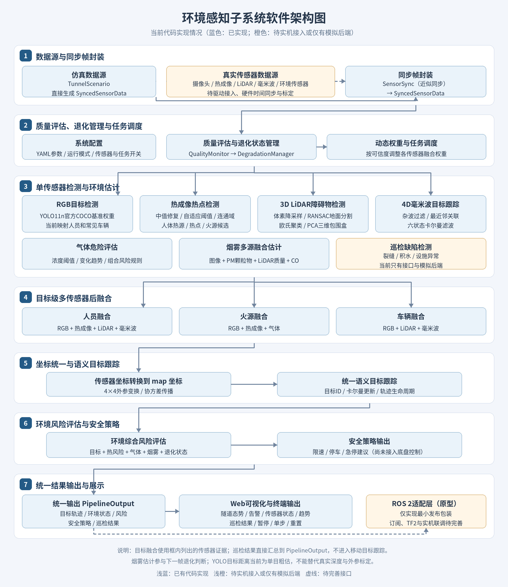
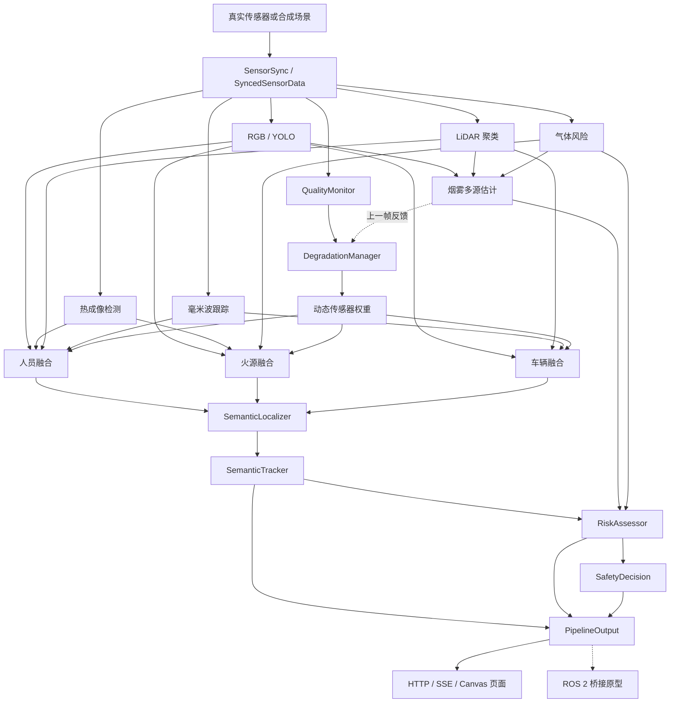
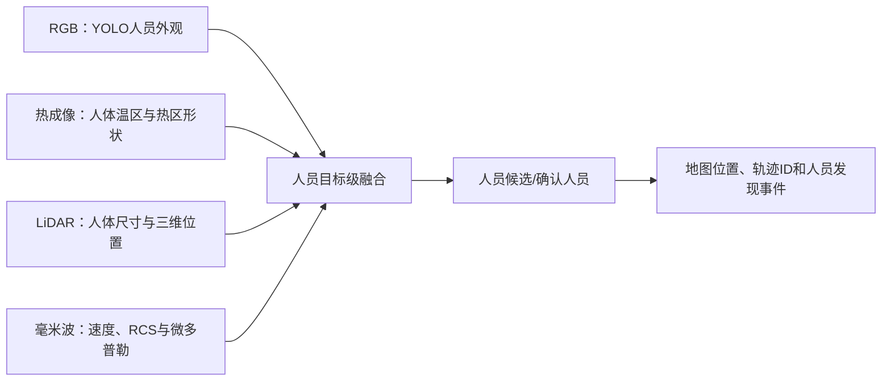
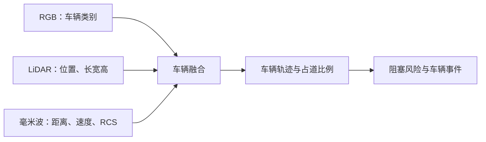
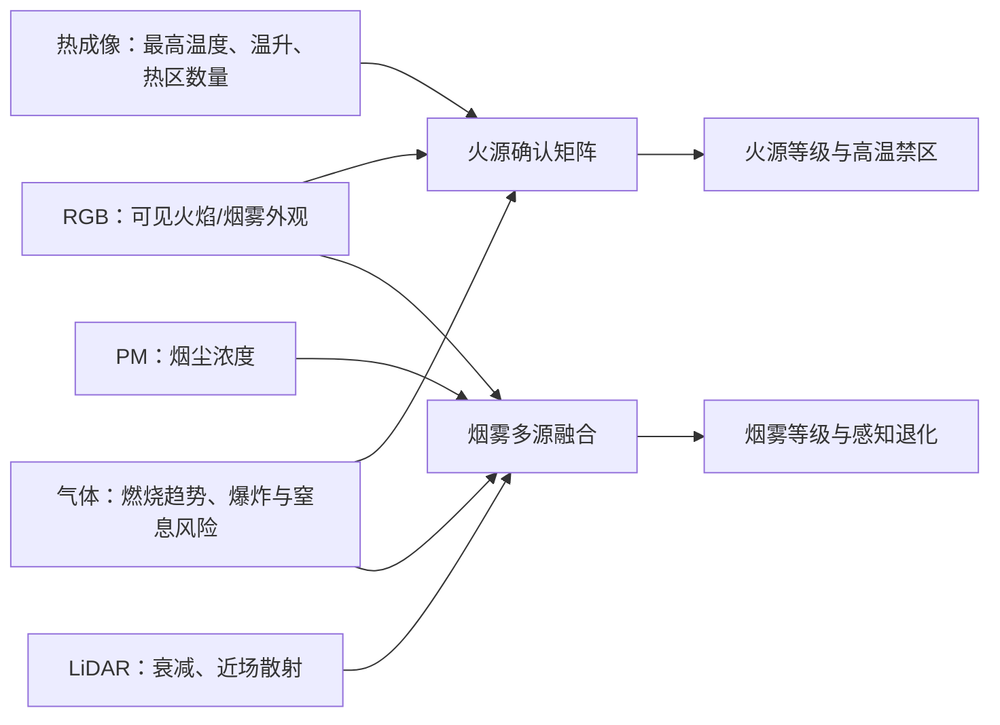
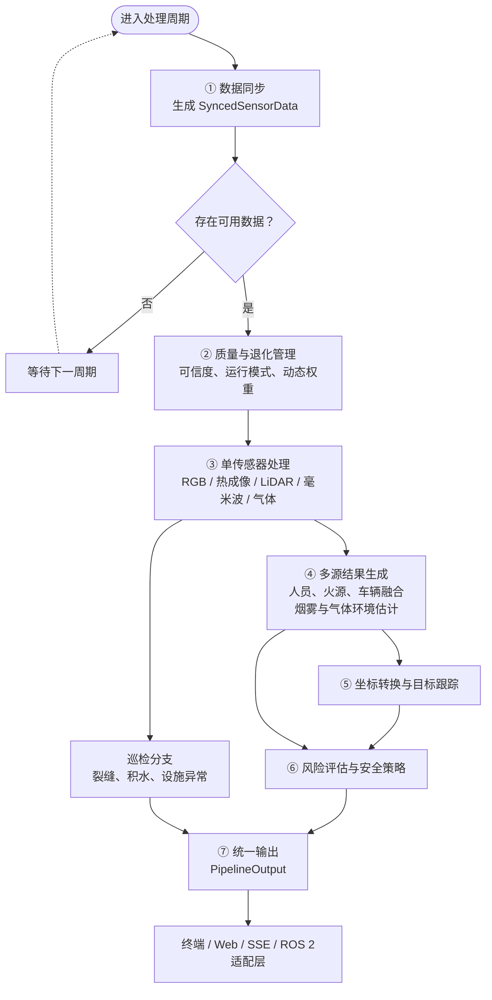
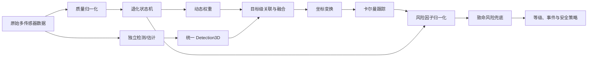

# 环境感知子系统实现报告

> 项目：隧道巡检与火灾救援环境感知系统  
> 当前版本：Python 原型实现  
> 报告日期：2026-09-07  
> 实现目录：`rescue_perception_py`

## 1. 系统架构



系统按职责划分为七层：

1. 数据输入与时间同步层；
2. 环境质量与退化管理层；
3. 单传感器独立检测层；
4. 目标级多传感器融合层；
5. 语义定位与统一跟踪层；
6. 综合风险与安全决策层；
7. 统一输出与可视化/ROS 2 接口层。

### 1.1 软件模块关系



### 1.2 模块与代码文件

| 层级 | 模块 | 主要代码文件 |
|---|---|---|
| 配置 | YAML加载、模式和开关 | `rescue_perception/config.py`、`config/perception_master.yaml`、`config/degradation.yaml` |
| 数据模型 | 枚举、输入、检测、轨迹、风险、输出 | `rescue_perception/types.py` |
| 同步 | 多源近似时间同步 | `rescue_perception/io/sensor_sync.py` |
| 主管线 | 单帧端到端调度 | `rescue_perception/perception_pipeline.py` |
| RGB | 后端接口、阈值过滤、烟雾掩膜统计 | `rescue_perception/detectors/rgb_detector.py` |
| YOLO | Ultralytics YOLO11n适配 | `rescue_perception/detectors/yolo_backend.py` |
| 热成像 | 热点分割、分类、热风险 | `rescue_perception/detectors/thermal_detector.py` |
| LiDAR | 地面分割、聚类、包围盒、质量 | `rescue_perception/detectors/lidar_cluster.py` |
| 雷达 | 杂波过滤、目标分类和跟踪 | `rescue_perception/detectors/radar_tracker.py` |
| 烟雾 | 图像/PM/LiDAR/CO融合 | `rescue_perception/detectors/smoke_estimator.py` |
| 气体 | 浓度等级和趋势组合风险 | `rescue_perception/detectors/gas_risk.py` |
| 巡检 | 裂缝、积水、设施接口 | `crack_segmenter.py`、`water_detector.py`、`facility_inspector.py` |
| 融合 | 人员、火源、车辆融合 | `fusion/person_fusion.py`、`fire_fusion.py`、`vehicle_fusion.py` |
| 关联 | 匈牙利匹配、门控、IoU | `rescue_perception/fusion/association.py` |
| 定位跟踪 | 坐标变换、全局语义跟踪 | `semantic_localizer.py`、`semantic_tracker.py` |
| 管理决策 | 质量、退化、风险 | `management/quality_monitor.py`、`degradation_manager.py`、`risk_assessor.py` |
| 仿真 | 场景和模拟推理后端 | `sim/scenario.py`、`sim/backends.py` |
| Web | HTTP API、SSE和页面 | `web/app.py`、`web/static/*` |
| ROS 2 | 最小发布包装 | `rescue_perception/io/ros2_bridge.py` |

### 1.3 感知设备作用与多源协同识别

环境感知系统没有要求每种设备独立完成全部识别任务，而是让不同设备提供互补证据：RGB负责目标语义，热成像负责温度，LiDAR负责三维结构，毫米波负责距离与运动，气体和PM负责不可见环境风险，里程计负责将结果放入统一地图。

#### 1.3.1 设备作用总表

| 设备 | 直接输出 | 在人员识别中的作用 | 在车辆识别中的作用 | 在火情识别中的作用 | 主要限制 |
|---|---|---|---|---|---|
| RGB摄像头 | 图像、二维框、类别、置信度 | 识别人员外观；专用模型可判断站立、蹲伏、倒地 | 识别汽车、卡车、公交车、摩托车类别 | 专用模型可识别火焰和烟雾外观 | 黑暗、浓烟、眩光和遮挡下容易退化 |
| 红外热成像仪 | 温度矩阵、热点、温度、热区形状 | 发现24～44℃人体热区，在无可见光时提供人员候选 | 判断车辆发动机、轮胎或事故区域是否异常升温 | 检测高温核心、温升、面积增长和火源候选 | 热设备可能像人体；三维深度和精细语义较弱 |
| 3D LiDAR | 三维点云、目标位置、长宽高 | 判断聚类尺寸是否符合人体，并提供三维位置 | 测量车辆尺寸、姿态和车道占用 | 不能直接识别火焰，但能提供烟雾衰减和周边障碍结构 | 烟尘可能导致散射、丢点和测距缩短 |
| 4D毫米波雷达 | 距离、方位、速度、RCS、微多普勒 | 通过速度、人体RCS范围和微多普勒提供人员运动证据 | 通过较高RCS、距离和速度提供车辆证据 | 不直接识别火焰，可在浓烟中持续监视火场附近运动目标 | 类别和外形分辨能力弱，易产生多径杂波 |
| 前后2D LiDAR | 单平面距离轮廓 | 提供近场人员/障碍安全距离补充 | 检测底盘高度附近的占道与碰撞风险 | 火情下维持近距离避障 | 当前项目仅预留数据和权重接口，未完成独立识别器 |
| 气体传感器 | CO、CO₂、O₂、CH₄、H₂S等 | 判断人员所在区域是否存在中毒、缺氧或窒息危险 | 判断事故车辆周围是否伴随燃烧或可燃气体 | 通过CO/CO₂上升、O₂下降、CH₄和温升确认燃烧及爆炸风险 | 无法单独确定火源空间位置，响应有扩散延迟 |
| PM传感器 | PM2.5、PM10 | 不直接识别人 | 不直接识别车辆 | 通过颗粒物突增辅助确认烟雾 | 粉尘、水雾也可能导致数值升高 |
| 温湿度传感器 | 环境温度、湿度 | 为人体温区和传感器质量提供环境参考 | 不直接识别车辆 | 环境升温参与火灾趋势，温湿度用于气体补偿 | 仅代表安装位置附近环境 |
| 里程计/定位 | 车体位姿、时间戳 | 将人员位置转换到地图坐标 | 将车辆与阻塞位置记录到地图 | 将火源和高温禁区定位到地图 | 里程计会累积漂移，需要融合定位或地图校正 |

#### 1.3.2 人员识别时各设备如何工作



1. RGB使用YOLO输出人员二维框和语义置信度。当前官方YOLO11n只能将COCO的`person`映射为站立人员，倒地、蹲伏和遮挡状态需要专用权重。
2. 热成像使用人体低温差通道提取候选。人体阈值为`max(24℃, 背景温度+3℃)`，平均温度需位于24～44℃，面积至少12像素，高宽比位于0.4～4.0。
3. 热成像高温通道使用`背景+max(30℃,3σ)`检测火源。包含高温核心或靠近高温核心的连通区禁止分类为人体，降低火焰外沿误报。
4. LiDAR检查目标宽度0.3～1.0m、深度0.2～0.8m、高度0.3～2.0m以及高宽比，给出人形结构证据和三维位置。
5. 毫米波检查人体RCS范围、低于2m/s的运动速度以及微多普勒特征，在烟雾中补充人员运动证据。
6. 融合器在轨迹周围1.5m内收集各源目标，按动态权重计算置信度。至少两个传感器形成正证据时，目标被多源确认。
7. 统一跟踪器连续更新3次后确认轨迹；确认人员置信度达到0.7时触发`person_found:<track_id>`事件。

在清晰环境下，典型链路为`RGB识别 + LiDAR定位`；在浓烟环境下，RGB权重降低，主要使用`热成像人体候选 + 毫米波运动 + LiDAR可用点云`。

#### 1.3.3 红外热成像人员识别的改进实现

热成像人员检测已经从“人体和火源共用一个高温阈值”改为双通道：

```text
人体低温差通道：T ≥ max(人体最低温度, T_bg + 3℃)
高温热点通道：  T > T_bg + max(30℃, 3σ_bg)
```

处理过程为：

```text
温度矩阵 → 3×3中值坏点修复 → 最近30帧最低值背景
→ 人体低温差/高温热点双阈值 → 完整升温区域8连通域
→ 高温核心标记 → 面积、温度和高宽比人体筛选
→ 最近历史帧匹配 → 温升与面积增长率 → Detection3D
```

本次改进还修正了质心坐标：连通域内部是`[row,col]`，对外统一保存为图像坐标`[x,y]=[col,row]`；历史热点优先匹配最近帧，并使用`now-prev_stamp`计算变化率。热成像人员三维位置目前仍采用默认6m深度，正式系统需要LiDAR投影或RGB-D深度。

#### 1.3.4 车辆识别时各设备如何工作



1. RGB区分汽车、卡车、公交车和摩托车，提供类别语义。
2. LiDAR聚类测量车辆三维中心、长宽高和朝向。长度大于2.0m、宽度大于1.2m、高度大于1.0m时形成车辆候选。
3. 毫米波对高RCS目标提供车辆类证据，并持续估计距离和速度。
4. 车辆融合以RGB目标为主，在2m邻域内寻找LiDAR和雷达证据；RGB缺失时仍可输出`vehicle_unknown`或`vehicle_like_obstacle`。
5. 车辆宽度除以默认3.5m车道宽度得到占道比例。比例超过0.7时判断严重阻塞并触发`accident_vehicle_blocking:<track_id>`。

#### 1.3.5 火情识别时各设备如何工作



1. RGB专用模型用于发现火焰或烟雾的视觉特征；当前官方YOLO11n不具备这些类别，因此现阶段RGB火焰主要来自合成后端。
2. 热成像检测高温核心，计算最高温度、温升速度、面积增长率、持续时间、圆形度和热点数量，区分火源、疑似火源、热设备和普通热表面。
3. 气体模块按CO、CO₂、O₂、CH₄和H₂S分级，并组合CO/CO₂上升、O₂下降和环境升温判断火灾气体特征。
4. 火源融合在2m范围内匹配RGB火焰与热热点，再利用气体证据调整0～4级火源等级。2级及以上作为确认火源。
5. 最高温度超过150/300/500℃时，高温禁区半径分别提高到3/5/8m。
6. 烟雾识别单独融合图像、PM、LiDAR质量和CO；烟雾分数达到0.65时触发`visibility_blind`并降低RGB、LiDAR权重。

#### 1.3.6 障碍物与近场安全

- 3D LiDAR移除地面后聚类非地面目标，输出三维障碍物和尺寸；
- 毫米波持续提供最近目标距离，在LiDAR受烟雾影响时仍可工作；
- 2D LiDAR设计用于车体前后近场防撞，但当前代码尚未完成独立避障处理；
- 最近毫米波目标小于5m时建议减速，小于3m时限制到20%，小于1m时要求停车；
- 当前输出只是策略建议，尚未连接底盘安全控制器。

#### 1.3.7 巡检任务中各设备如何工作

- RGB用于裂缝、积水、渗水和设施外观识别；
- 热成像用于发现设备过热、渗水温差和异常热分布；
- LiDAR地面点用于估算积水范围、地面变化和缺陷实际尺度；
- 里程计用于将缺陷关联到隧道地图位置；
- 当前裂缝、积水和设施检测只有接口与合成后端，真实模型和标定尺度尚未实现。

#### 1.3.8 传感器失效时的替代关系

| 场景 | 主要传感器 | 降权传感器 | 系统处理 |
|---|---|---|---|
| 正常光照、无烟 | RGB、LiDAR | 无 | RGB提供类别，LiDAR提供位置和尺寸 |
| 低照度 | 热成像、LiDAR、毫米波 | RGB | 保留热目标、三维结构和运动证据 |
| 重烟 | 热成像、毫米波、气体、PM | RGB、3D LiDAR | 使用热与雷达寻找目标，用气体/PM判断环境 |
| LiDAR散射严重 | 毫米波、热成像 | LiDAR | 雷达承担距离和运动检测，限制运行速度 |
| RGB完全失效 | 热成像、LiDAR、毫米波 | RGB置零 | 人员只能作为热/形状/运动融合结果，精细类别下降 |
| 多关键传感器失效 | 毫米波、2D LiDAR、气体 | RGB和3D LiDAR关闭 | 进入PERCEPTION_DEGRADED，要求停车或遥控 |

## 2. 端到端实现流程

主管线入口为 `PerceptionPipeline.spin_once()`；连续运行时必须复用同一个主管线对象，因为烟雾平滑、热背景、退化状态和目标轨迹均保存跨帧状态。

### 2.1 单帧处理流程图



图中只保留单帧处理主干，便于在普通报告页面中阅读。独立检测、烟雾/气体估计和巡检分支在逻辑上可以并行，但当前Python原型在`spin_once()`内仍按代码顺序同步执行。烟雾估计、LiDAR质量、热背景和目标轨迹会保存为跨帧状态，供下一帧的退化判断、热目标变化分析和轨迹更新使用；各阶段的函数、字段和算法细节见后续章节。

### 2.2 分阶段说明

#### 阶段0：质量、退化与权重

1. `QualityMonitor.assess()`计算RGB亮度/对比度/清晰度、热图有效性、LiDAR有效点、雷达目标和环境传感器可信度。
2. 配置中禁用的传感器被明确标记为`failed/disabled`，对应权重置零。
3. `DegradationManager.update()`根据上一帧烟雾估计和当前可信度更新四级状态。
4. 从状态基础权重出发乘以各传感器可信度，然后归一化。

这里故意使用上一帧烟雾值和上一帧LiDAR质量，以打破“本帧质量依赖本帧检测，而本帧检测权重又依赖本帧质量”的循环，但会产生约一帧决策延迟。

#### 阶段1：单传感器独立检测

各传感器独立生成`Detection3D`或风险摘要，未启用的模块不执行算法，避免无效算力消耗。

#### 阶段2：目标级多源融合

系统不是直接融合原始像素和点云，而是先将各源结果统一成目标候选，然后按照人员、火源、车辆三类分别关联和加权。这种后融合方式接口清晰，易于替换模型，也便于在单一传感器失效时降权运行。

#### 阶段3：巡检分支

巡检模式生成裂缝、积水和设施异常。巡检结果直接进入`PipelineOutput`，不进入移动目标轨迹池，防止固定设施或缺陷被当作移动目标。

#### 阶段4：定位和跟踪

瞬时融合测量先转换到`map`坐标，再进入持久跟踪器。这样预测帧不会被重复施加传感器外参。

#### 阶段5：风险和安全决策

风险层组合热风险、气体、障碍物、车辆占道、深度、RGB和运动因素；安全层再将环境风险映射为速度上限、停车要求和远程确认要求。

#### 阶段6：统一输出

所有目标、环境、权重、烟雾、气体、风险、安全和巡检结果统一封装为`PipelineOutput`，供终端、Web和ROS 2适配层使用。

## 3. 数据处理与算法原理

### 3.1 RGB与YOLO检测

代码：`rgb_detector.py`、`yolo_backend.py`

当前提供统一`DetectionBackend.detect(image)`接口。合成后端用于测试，`YoloBackend`使用官方`yolo11n.pt`完成基准检测。

YOLO后端处理过程：

1. 输入NumPy RGB图像；
2. 调用Ultralytics预测，配置图像尺寸、置信度和NMS IoU；
3. 读取`xyxy`、`confidence`和`class id`；
4. 将COCO的person、car、truck、bus、motorcycle映射到系统类别；
5. 无关COCO类别直接忽略；
6. 转换成`Detection3D`；
7. `RgbDetector`按人员、车辆、火焰的类别阈值进行二次过滤。

当前没有真实深度时，使用目标框高度进行单目粗测距：

```text
前向距离 Z ≈ 焦距 fy × 类别先验高度 H / 像素框高度 h
横向位置 Y ≈ -(u - cx) × Z / fx
方位角 bearing = atan2(u - cx, fx)
```

该结果标记`depth_valid=False`，只适合链路联调，不能作为实机安全定位依据。正式系统应由RGB-D、双目或LiDAR投影提供深度，并加载真实相机内外参。

官方COCO模型只能覆盖人员和常见车辆；火焰、烟雾、倒地人员等类别需要隧道数据微调。RGB烟雾掩膜接口已能计算覆盖率、平均概率和像素质心，但官方检测模型不输出烟雾掩膜。

### 3.2 热成像检测

代码：`thermal_detector.py`

处理过程如下：

1. 使用3×3中值滤波修复与邻域中值相差超过20℃的坏点；
2. 保留最近30帧温度图，逐像素取最小值建立不易受短时热点污染的背景；
3. 人体通道阈值为`max(24℃, T_bg+3℃)`，火源通道阈值为`T_bg+max(30℃,3σ_bg)`；
4. 对完整升温区域执行8连通域提取，人体面积至少12像素、热点面积至少9像素；
5. 标记连通区是否包含或邻近高温核心，禁止此类区域被分类成人体；
6. 计算最大/平均/最小温度、面积、周长、圆形度和边缘梯度；
7. 优先与最近历史帧的25像素邻域热点匹配，按实际时间差计算`dT/dt`、`dA/dt`和持续时间；
8. 根据温度、形状、变化速度和人体温区分类为人体热源、火源、疑似火源、热设备、温暖表面或普通热异常；
9. 依据最高温度和火源数量输出0～4级热风险。

当前三维位置使用默认6m深度和像素比例估算，同样需要真实标定或跨传感器深度补充。

### 3.3 3D LiDAR处理

代码：`lidar_cluster.py`

处理链为：

```text
距离直通滤波 → 体素降采样 → RANSAC地面分割
→ 空间哈希欧氏聚类 → PCA三维包围盒 → 尺寸规则分类
```

- 保留0.5～80m点云；
- 正常模式体素尺寸0.1m，退化模式0.3m；
- RANSAC地面距离阈值0.05m，最大100次；
- 正常聚类距离0.3m，退化时0.5m；
- PCA特征向量确定目标朝向，投影极差确定长宽高；
- 尺寸规则将目标区分为车辆候选、人员候选和一般障碍物。

质量指标包括有效点比例、近场低强度散射比例、95%距离分位数和强度随距离衰减，用于烟雾估计和LiDAR可信度调整。

### 3.4 4D毫米波雷达

代码：`radar_tracker.py`

1. 将距离、方位角等极坐标量转换为平面坐标；
2. 使用多普勒、RCS和连续静止帧过滤静态杂波；
3. 采用最近邻门控将当前点与历史轨迹关联；
4. 使用六维卡尔曼状态`[x,y,vx,vy,ax,ay]`完成预测和更新；
5. 使用RCS、速度和微多普勒规则生成车辆或人员候选；
6. 目标最多coast 10帧，超过后删除。

毫米波在重烟场景保持较高权重，是RGB和LiDAR退化时的主要距离与运动证据。

### 3.5 烟雾多源估计

代码：`smoke_estimator.py`

烟雾估计融合四类证据：

```text
图像烟雾概率与覆盖率：0.30
PM颗粒物变化：         0.25
LiDAR衰减与近场散射：  0.30
CO变化：               0.15
```

PM和CO分别使用30s与60s滚动最低值作为动态基线。传感器健康状态差时对应权重衰减；重烟时降低图像证据，避免视觉自我强化。加权结果经过`alpha=0.3`的指数移动平均：

```text
S_t = α × S_raw + (1-α) × S_(t-1)
```

阈值为0.15、0.35、0.65，依次划分无明显烟雾、轻烟、重烟和近似盲区状态。烟雾质心跨帧变化还能给出图像平面扩散方向。

### 3.6 气体风险

代码：`gas_risk.py`

系统监测CO、CO₂、O₂、CH₄爆炸下限比例和H₂S，执行以下处理：

1. 对读数进行温湿度修正；
2. 按各气体三级阈值计算独立危险等级；
3. 取最高等级作为基础风险；
4. 使用历史线性趋势判断CO、CO₂上升、O₂下降和环境升温组合；
5. 输出火灾气体特征、爆炸风险、窒息风险和告警文本。

默认阈值在`config.py`中定义，例如CO为50/200/1200ppm，O₂为19.5/16/10%。这些参数目前是工程原型值，实机部署前必须依据适用规范、传感器量程和现场安全要求重新审核。

### 3.7 人员融合

代码：`person_fusion.py`

系统收集RGB人员、热人体、LiDAR人形聚类和毫米波候选。候选与轨迹的代价由空间距离、类别差异、温度差异和时间差组合，并使用门控匈牙利算法做一对一匹配。

融合置信度为有效传感器置信度的动态加权平均。重烟时RGB贡献再次缩小；热成像按24～44℃人体温区验证；LiDAR按高度、宽度和长宽比验证；雷达按速度和微多普勒验证。多源证据达到条件后目标被确认。

### 3.8 火源融合

代码：`fire_fusion.py`

火源融合组合RGB火焰、热热点和气体火灾特征。空间邻近的RGB与热源相互增强；气体与爆炸证据提高置信度和风险。根据最高温度生成高温禁区半径，并把火源或火源候选交给全局跟踪与风险层。

### 3.9 车辆融合

代码：`vehicle_fusion.py`

RGB提供车辆类别，LiDAR提供可靠尺寸，毫米波提供RCS和运动证据。车辆宽度与默认3.5m车道宽度的比值用于计算占道比例：超过0.7视为严重阻塞，超过0.3视为部分阻塞。

### 3.10 语义跟踪与定位

代码：`semantic_localizer.py`、`semantic_tracker.py`

定位器保存RGB、热成像、LiDAR和雷达到`map`的4×4齐次变换。位置按`p_map = T_sensor_to_map × p_sensor`转换，协方差通过旋转块的一阶雅可比传播。

全局跟踪器按person、fire、vehicle、obstacle语义组匹配，采用平面匀速模型和卡尔曼更新。新测量置信度低于0.3时不建立轨迹；连续更新达到3帧后确认；15帧未匹配后删除；同类轨迹距离小于0.5m时合并。

### 3.11 巡检算法

代码：`crack_segmenter.py`、`water_detector.py`、`facility_inspector.py`

- 裂缝：后端生成分割掩膜，当前代码负责像素统计、长度/宽度近似和结果封装；真实分割模型尚未实现。
- 积水：预留RGB、热图、地面点和2D扫描输入，真实分割与深度估计尚未实现。
- 设施：预留RGB与热图联合检查接口，真实设施检测和异常分类模型尚未实现。

当前Web演示使用合成后端生成巡检结果，不能视为真实识别能力。

## 4. 算法实现原理详解

本章从数学模型和代码实现两个层面说明关键算法。项目采用“质量先评估、单传感器先检测、目标级后融合、统一时序跟踪、场景级风险决策”的分层方法。这样可以让每个传感器独立验证，也能在环境恶化或部分传感器失效时动态调整贡献。

### 4.1 传感器质量评分原理

代码：`rescue_perception/management/quality_monitor.py`

系统首先将不同量纲的数据质量指标归一化到`[0,1]`。`clamp(x)`用于限制结果范围，0代表不可用，1代表质量良好。

RGB质量由清晰度、亮度和对比度组成：

```text
B = 1 - |mean(I) - 128| / 128
C = clamp(RMS(I) / 80)
S = clamp(var(Gx + Gy) / 500)
Q_rgb = clamp(0.35S + 0.25B + 0.25C + 0.15)
```

其中`Gx`和`Gy`为图像梯度。亮度接近中间灰度时评分较高，梯度方差反映边缘清晰程度，RMS反映图像对比度。固定的0.15基础项避免普通低纹理区域被立即判断为完全失效。

热成像质量计算为：

```text
Q_thermal = clamp(0.35V + 0.35U + 0.30G)
```

`V`是有效温度范围`(-40℃,500℃)`内像素比例，`U=1-std(中心区域)/50`表示温度均匀性，`G`是平均温度梯度归一化结果。该算法评价的是热图是否可用，并不判断场景是否存在热点。

LiDAR质量由有效点比例`E`、近场散射`N`、最大有效距离`R`和强度衰减`A`组成：

```text
Q_lidar = clamp(0.30E + 0.25(1-N) + 0.25 clamp(R/80) + 0.20(1-A))
```

毫米波质量使用最近10帧目标数稳定度和RCS方差；气体传感器则按湿度进行简化降权。质量评分最终同时用于退化状态判断和传感器融合权重修正。

### 4.2 退化状态机与迟滞原理

代码：`rescue_perception/management/degradation_manager.py`

系统使用四状态有限状态机：

```text
CLEAR → LOW_VISIBILITY → HEAVY_SMOKE → PERCEPTION_DEGRADED
```

进入危险状态使用较敏感的阈值，恢复则使用更严格的反向阈值。例如，从CLEAR进入LOW_VISIBILITY的烟雾阈值为0.15，而从LOW_VISIBILITY恢复CLEAR要求烟雾低于0.10、RGB可信度高于0.70且亮度恢复。不同进入/退出阈值形成迟滞区，可抑制阈值附近抖动。

状态机只执行相邻或受约束的恢复转换。3秒内切换超过2次时，状态锁定3秒，避免噪声导致权重、速度建议和页面状态频繁跳变。

### 4.3 动态传感器权重原理

每种模式先给出基础权重`b_i`，再由实时可信度`q_i`修正：

```text
             0,                     q_i < 0.10
w'_i =       b_i × q_i / 0.30,      0.10 ≤ q_i < 0.30
             b_i,                   q_i ≥ 0.30

w_i = w'_i / Σw'_j
```

重烟模式还会将RGB权重再乘0.30，并保证雷达和气体具有最低权重；完全退化时RGB和3D LiDAR权重直接置零。配置禁用的传感器同样先置零，再整体归一化。

动态权重不是检测置信度，而是系统对某类传感器在当前环境下的信任程度。最终目标置信度由“传感器权重×该传感器检测置信度”共同决定。

### 4.4 YOLO检测与后处理原理

代码：`rescue_perception/detectors/yolo_backend.py`、`rgb_detector.py`

YOLO将图像划分为多尺度特征，直接回归目标边界框、类别概率和目标存在概率。当前推理由Ultralytics封装执行，后端读取经过模型解码和非极大值抑制后的输出。

非极大值抑制的核心是交并比：

```text
IoU(A,B) = area(A∩B) / area(A∪B)
```

同类别框按置信度排序，保留最高分框，并删除与其IoU超过配置阈值的重复框。当前配置推理置信度为0.25、NMS IoU阈值为0.50。模型输出后，系统还按照人员、车辆和火焰分别执行第二级业务阈值过滤。

官方`yolo11n.pt`输出COCO类别。本项目将`person/car/truck/bus/motorcycle`映射为内部`ObjectClass`，其他类别暂时丢弃。模型本身不输出真实三维坐标，当前仅用框高和类别先验高度估算距离：

```text
Z = fy × Hreal / hpixel
Y = -(u-cx) × Z / fx
bearing = atan2(u-cx, fx)
```

这种方法依赖目标真实高度假设，蹲伏、遮挡、斜坡和车辆姿态都会带来较大误差，所以输出标记`depth_valid=False`。真实系统必须改用RGB-D或LiDAR投影。

### 4.5 热点分割、形状描述与时序分类

代码：`rescue_perception/detectors/thermal_detector.py`

热检测先通过3×3中值消除离群坏点，再对最近30帧逐像素取最小值作为背景。这相当于假设短时出现的高温区域是前景，而窗口内最低温度更接近稳定环境。

人体和高温热点采用两个阈值：

```text
T_person = max(24℃, T_background + 3℃)
T_hot = T_background + max(30℃, 3σ_background)
```

人体通道解决了原先`背景+30℃`过高而漏检人体的问题；高温通道继续保留固定安全温差和统计异常要求。完整升温区域通过8连通域聚合，若区域包含或邻近高温核心便禁止判断为人体，防止火焰外围温区误报。圆形度计算为：

```text
circularity = 4πA / P²
```

圆形度接近1表示形状规则；不规则、快速升温且面积增长的高温区域更像火焰，稳定且规则的高温区域更像设备。时序变化量为：

```text
dT/dt = (Tmax_t - Tmax_(t-1)) / Δt
dA/dt = (A_t - A_(t-1)) / (A_(t-1) × Δt)
```

最终分类是温度、圆形度、温升、面积增长、持续时间和人体温区的规则组合。热点质心对外统一为`[x,y]`，变化率使用相邻历史帧真实时间差。该算法不需要训练数据，但规则对不同热像仪、距离和发射率较敏感，需要实测标定。

### 4.6 LiDAR地面分割、聚类与包围盒

代码：`rescue_perception/detectors/lidar_cluster.py`

体素降采样将空间划分为边长`l`的立方体，同一体素内所有点取均值，降低点数并抑制随机噪声：

```text
voxel_key = floor([x,y,z] / l)
```

RANSAC每次随机选取3个点拟合地面平面`z=ax+by+c`，计算所有点到平面的残差，将残差小于0.05m的点作为内点。迭代100次后选择内点数量最多的平面作为地面，剩余点进入障碍物聚类。

欧氏聚类使用空间哈希。点首先映射到边长等于聚类容差的网格，只搜索当前网格及26个邻格，从而避免全点云两两距离比较。相邻点距离不大于0.3m时归入同一连通簇；重烟模式使用0.5m容差。

每个点簇计算协方差矩阵：

```text
C = (1/N) Σ(p_i-μ)(p_i-μ)ᵀ
```

对`C`做特征值分解，主特征向量作为目标主方向。点云投影到主轴后，各轴最大值与最小值之差形成长、宽、高，第一水平主轴计算偏航角。最终通过尺寸规则产生车辆候选、人员候选或一般障碍物。

### 4.7 雷达运动模型与卡尔曼滤波

代码：`rescue_perception/detectors/radar_tracker.py`

雷达极坐标首先转换为直角坐标：

```text
x = range × cos(azimuth)
y = range × sin(azimuth)
```

内部状态为`X=[x,y,vx,vy,ax,ay]ᵀ`。预测阶段使用离散运动模型：

```text
X̂_k = F X_(k-1)
P̂_k = F P_(k-1) Fᵀ + Q
```

当前实现的位置由速度推进、速度由加速度推进。测量只观测`x,y`，更新过程为：

```text
innovation y = z - H X̂
S = H P̂ Hᵀ + R
K = P̂ Hᵀ S⁻¹
X = X̂ + Ky
P = (I-KH)P̂
```

当前数据关联采用3m门限内的一对一贪心最近邻，而不是匈牙利算法。RCS较高判为车辆类大目标，人体RCS范围加微多普勒特征判为人员候选。未匹配轨迹通过coast保留最多10帧。

### 4.8 多传感器关联与人员置信度融合

代码：`rescue_perception/fusion/association.py`、`person_fusion.py`

人员候选与轨迹的关联代价为：

```text
C = 0.4D_position + 0.3D_class + 0.2D_temperature + 0.1D_time
```

距离超过3m的组合被设置为不可关联；随后使用匈牙利算法寻找全局最小总代价的一对一分配，并删除代价超过2.0的匹配。

每个轨迹周围1.5m内收集不同传感器证据。人员融合置信度为：

```text
confidence = Σ(w_i × adjusted_confidence_i) / Σw_i
```

其中热成像置信度按人体温区修正，LiDAR按长宽高和高宽比生成形状分数，雷达按RCS、速度和微多普勒生成分数。至少两个传感器形成正证据时目标才被多源确认；重烟时RGB贡献再次乘0.1，而热成像与雷达联合证据能够保留人员候选。

### 4.9 火源确认与高温禁区

代码：`rescue_perception/fusion/fire_fusion.py`

火源模块使用决策矩阵而不是单一加权平均。RGB、热成像和气体证据组合形成0～4级火源：

- 热置信度高、热点多且温度超过500℃时为4级；
- 温度超过300℃并有多个热点，或热与气体证据同时较强时为3级；
- RGB与热成像一致，或热成像与气体一致时为2级确认火源；
- 只有单一中等证据时保留1级疑似火源。

气体火灾趋势增加0.10置信度，爆炸风险增加0.15并将等级至少提升到3。高温禁区采用离散温度映射：

| 最高温度 | 禁区半径 |
|---:|---:|
| `>500℃` | 8m |
| `>300℃` | 5m |
| `>150℃` | 3m |
| 其他 | 1.5m |

该半径是原型安全规则，不是热辐射物理模型。正式系统应结合火源规模、通风、隧道断面和热辐射计算验证。

### 4.10 统一语义跟踪与坐标变换

代码：`rescue_perception/fusion/semantic_localizer.py`、`semantic_tracker.py`

坐标变换使用齐次矩阵：

```text
[p_map, 1]ᵀ = T_sensor_to_map × [p_sensor, 1]ᵀ
```

位置和姿态协方差使用变换矩阵旋转块构造的一阶雅可比`J`传播：

```text
P_map = J P_sensor Jᵀ
```

全局跟踪器将目标划分为person、fire、vehicle和obstacle语义组，只允许同组匹配，防止人员轨迹被车辆测量更新。状态为`[x,y,z,length,width,height,vx,vy]`，采用平面匀速预测和位置卡尔曼更新。目标连续更新达到3次后确认，15帧未匹配后删除；同组目标距离小于0.5m时合并。

### 4.11 场景风险融合原理

代码：`rescue_perception/management/risk_assessor.py`

不同输入先归一化为七个风险因子：热风险、气体风险、近障碍、车辆占道、深度无效、RGB退化和运动目标。根据正常、低可见度或重烟模式选择风险权重：

```text
R_weighted = Σ(w_i × f_i) / Σw_i
```

单纯加权平均可能把致命单项风险稀释，因此系统设置最低风险兜底：

- 热风险达到4级时，综合分数至少0.95；
- 气体风险达到3级时，至少0.90；
- 最近雷达障碍小于2m时，至少0.85；
- 存在严重占道时，至少0.70。

最终阈值为：`R≥0.85`为CRITICAL，`R≥0.60`为HIGH，`R≥0.30`为MEDIUM，否则为LOW。烟雾分数当前不直接作为独立风险因子，而是通过可见度退化状态改变风险权重，并在达到0.65时触发`visibility_blind`事件。

### 4.12 算法实现流程汇总



## 5. 数据结构与内部接口

### 5.1 输入数据`SyncedSensorData`

| 字段 | 类型/形态 | 含义 |
|---|---|---|
| `stamp` | `float` | 同步帧参考时间戳，单位秒 |
| `rgb_image` | `numpy.ndarray` | RGB图像，目前允许二维或三通道数组 |
| `thermal_image` | `numpy.ndarray` | 用于显示或模型输入的热图 |
| `temperature_matrix` | `numpy.ndarray` | 辐射温度矩阵，单位℃ |
| `lidar_points` | `N×3/N×4 ndarray` | XYZ及可选强度点云 |
| `radar_targets` | `List[Dict]` | 距离、方位、俯仰、多普勒、RCS等 |
| `scans` | 字典/数组 | 前后2D LiDAR数据 |
| `gas` | `GasReadings` | CO、CO₂、O₂、CH₄、H₂S、VOC、PM |
| `pm` | `Dict` | 独立PM2.5/PM10输入，优先于气体设备内PM |
| `temperature_humidity` | `Dict` | 环境温湿度 |
| `odometry` | `Dict` | 车辆位置和航向 |
| `sync_status` | `Dict[str,float]` | 各数据源相对参考时刻的误差，单位ms |

### 5.2 统一检测接口`Detection3D`

所有目标型单传感器检测最终转换为统一结构，核心字段包括：

- 时间戳、传感器来源和目标类别；
- 置信度、三维位置、长宽高和航向；
- 速度、六维协方差；
- 最大/最小温度；
- 深度是否有效、方位角和俯仰角；
- `extra`扩展字典，例如YOLO二维框、雷达RCS或事故状态。

统一接口使融合层不依赖具体模型框架。替换YOLO、TensorRT或热模型时，只需确保后端继续输出`Detection3D`。

### 5.3 融合跟踪接口`TrackedObject`

`TrackedObject.state`固定为：

```text
[x, y, z, length, width, height, vx, vy]
```

另外保存全局轨迹ID、来源位掩码、确认状态、协方差、首次/最近观测时间、温度、高温禁区、占道比例、事故状态和扩展属性。

### 5.4 统一输出`PipelineOutput`

输出包括：

- `targets`：全局语义目标轨迹；
- `status`：OK、DEGRADED或LOST；
- `mode`：四级退化状态；
- `weights`和`env_quality`；
- `smoke`、`gas`、`thermal_risk_level`；
- `risk`和`safety`；
- `cracks`、`water_regions`、`facility_anomalies`。

## 6. 对外数据接口

### 6.1 算法调用接口

```python
config = PerceptionConfig.from_yaml(
    "config/perception_master.yaml",
    "config/degradation.yaml",
    run_mode="rescue",
)
pipeline = PerceptionPipeline(config)
pipeline.initialize()
output = pipeline.spin_once(synced_data, now=timestamp)
```

若使用消息缓冲器：

```python
sync.push("rgb", stamp, rgb_image)
sync.push("lidar", stamp, lidar_points)
output = pipeline.spin_from_sync(sync)
```

### 6.2 推理后端接口

RGB后端必须实现：

```python
class DetectionBackend:
    def detect(self, image) -> list[Detection3D]:
        ...
```

裂缝、积水和设施也分别定义了分割或检查后端接口。真实模型应实现对应接口，通过`set_backend()`注入，不应把框架特定代码写入主管线。

### 6.3 Web接口

| 方法 | 地址 | 方向 | 内容 |
|---|---|---|---|
| GET | `/`、`/index.html` | 服务端→浏览器 | 页面入口 |
| GET | `/static/*` | 服务端→浏览器 | JS/CSS资源 |
| GET | `/api/state` | 服务端→浏览器 | 最新完整JSON快照 |
| GET | `/events` | 服务端→浏览器 | SSE实时状态流，当前10Hz |
| POST | `/api/control` | 浏览器→服务端 | pause/resume/step/reset/speed |

SSE负载由`build_payload()`生成，包括目标、风险分数、热区、烟雾、气体、权重、可信度、事件和巡检结果。浏览器使用`EventSource`接收，断线后自动重连。

### 6.4 ROS 2接口现状

`Ros2PerceptionNode`当前仅为最小包装：

- `/perception/target_observations`：字符串形式目标摘要；
- `/perception/status`：字符串形式状态摘要；
- 发布队列深度为10。

尚未实现真实订阅、`message_filters`同步、TF2、QoS策略、诊断消息、自定义目标消息、生命周期节点和控制系统正式接口。因此当前ROS 2模块只能用于说明适配位置，不能直接作为生产节点。

## 7. 时间周期与时序机制

### 7.1 当前周期表

| 对象 | 配置/实现 | 当前含义 |
|---|---:|---|
| 主管线声明频率 | `pipeline_rate=100Hz` | 配置值，目前主管线本身不创建100Hz定时器 |
| 终端仿真 | `dt=0.1s` | 实际10Hz，共121帧、12s |
| Web计算循环 | `dt=0.1s` | 实际10Hz，可改变仿真时间倍率 |
| SSE推送 | `0.1s` | 每个客户端约10Hz推送最新快照 |
| 默认同步容差 | `10ms` | 每个传感器可单独覆盖 |
| 同步缓冲 | 每源50条 | 超过后丢弃最旧数据 |
| 同步降级 | `>100ms` | 健康状态标为sync_error |
| 同步超时 | `>500ms`或缺失 | 标为timeout/无穷误差 |
| RGB火焰历史 | 5帧 | 10Hz下约0.5s |
| 热背景窗口 | 30帧 | 10Hz下约3s |
| 热检测默认帧间隔 | `0.1s` | 用于温升与面积增长率 |
| PM动态基线 | 30s | 滚动最低值 |
| CO动态基线 | 60s | 滚动最低值 |
| 雷达coast | 10帧 | 10Hz下约1s后删除 |
| 全局轨迹确认 | 3次更新 | 连续命中后确认 |
| 全局轨迹coast | 15帧 | 10Hz下约1.5s后删除 |
| 退化振荡检测/锁定 | 3s | 防止状态快速来回切换 |

必须注意：`pipeline_rate=100Hz`与当前实际10Hz不一致。现阶段应把100Hz理解为目标/占位配置，不能在验收材料中声称系统已经达到100Hz。真实部署应采用多速率调度，例如高频雷达/里程计独立更新，YOLO、热成像和风险输出按各自预算运行，并记录真实端到端延迟。

### 7.2 同步算法

`SensorSync`使用近似时间同步：

1. 取所有可用输入最新时间戳的最大值作为参考时刻；
2. 在每个传感器缓冲中查找与参考时刻差值最小的样本；
3. 只有差值不超过该传感器容差才选中；
4. 容差外输入在同步帧中保持为空，误差记录为无穷大；
5. 被选中样本的真实时间差写入`sync_status`。

当前`pull()`不会消费缓冲样本，调用方需要自行避免对同一组时间戳重复处理；实机版本还应加入消息过期、乱序、时钟源和硬件时间同步策略。

## 8. 事件触发方式

系统包含周期触发、状态触发、风险事件触发和人工控制触发四种机制。

### 8.1 周期触发

- 终端仿真按照0.1s步长主动调用`spin_once()`；
- Web后台线程每0.1s计算一帧；
- SSE连接每0.1s推送当前完整状态；
- 未来ROS 2版本应由传感器回调和定时器驱动。

### 8.2 退化状态触发

| 当前状态 | 主要进入条件 | 主要恢复条件 |
|---|---|---|
| CLEAR | 初始状态 | — |
| LOW_VISIBILITY | 烟雾分数>0.15，或RGB可信度<0.5，或亮度<30 | 烟雾<0.10且RGB可信度>0.70且亮度>50 |
| HEAVY_SMOKE | 烟雾>0.35，或RGB/LiDAR同时明显退化 | 指标恢复到带迟滞的低可见区间 |
| PERCEPTION_DEGRADED | RGB<0.1、LiDAR<0.2、热成像<0.3，或气体传感器失败 | 关键传感器恢复后降级回退 |

状态变化过于频繁时，系统在3s窗口内检测振荡并执行3s切换锁。配置文件中给出了转移参数，但当前状态机仍有部分阈值直接定义在Python实现中，后续应完全配置化。

### 8.3 语义风险事件

`RiskAssessor`每帧按当前轨迹和环境生成事件：

| 事件格式 | 触发条件 |
|---|---|
| `fire_confirmed:<track_id>` | 火焰/火源候选轨迹已确认 |
| `person_found:<track_id>` | 人员轨迹已确认且置信度≥0.7 |
| `accident_vehicle_blocking:<track_id>` | 车辆占道比例>0.7 |
| `gas_danger_level` | 气体风险等级≥2 |
| `perception_lost` | 进入PERCEPTION_DEGRADED |
| `visibility_blind` | 烟雾分数≥0.65 |

风险事件在服务端是“当前帧条件成立即出现”的状态型事件，不是一次性消息队列。前端通过比较本帧与上一帧事件集合，只在事件从未出现变为出现时写入日志，从而避免SSE重复刷屏。

### 8.4 安全动作触发

| 条件 | 安全等级 | 速度上限 | 动作 |
|---|---|---:|---|
| 外部急停 | ESTOP | 0 | IMMEDIATE_ESTOP |
| 热风险≥4、感知完全退化或最近雷达目标<1m | STOP_REQUIRED | 0 | STOP_AND_WAIT |
| 热风险≥3、综合风险高或最近目标<3m | DEGRADED | 20% | LOW_SPEED_CAUTIOUS |
| 热风险≥2、低可见度及以上或最近目标<5m | WARNING | 50% | REDUCED_SPEED |
| 其他 | OK | 100% | NORMAL_OPERATION |

当前只是安全建议输出，没有连接底盘控制器；页面中的限速或停车不能替代车辆控制系统的安全链路。

### 8.5 Web人工触发

- `pause`：暂停自动时间推进；
- `resume`：恢复自动运行；
- `step`：进入暂停并只推进一个步长；
- `reset`：时间归零并重建有状态主管线，清除轨迹、烟雾EMA和热历史，同时保留模型后端和外参；
- `speed`：设置0.1～20倍仿真时间倍率。

## 9. 退化运行与容错策略

四种模式的基础权重如下，顺序为RGB、热成像、3D LiDAR、毫米波、2D LiDAR、气体：

| 模式 | 基础权重 |
|---|---|
| CLEAR | `[0.90, 0.40, 0.85, 0.30, 0.20, 0.20]` |
| LOW_VISIBILITY | `[0.50, 0.80, 0.60, 0.50, 0.30, 0.40]` |
| HEAVY_SMOKE | `[0.10, 0.85, 0.25, 0.85, 0.50, 0.60]` |
| PERCEPTION_DEGRADED | `[0.00, 0.30, 0.00, 0.80, 0.60, 0.60]` |

实际融合权重还要乘以传感器可信度并归一化。策略体现了以下原则：

- 清晰环境优先RGB和LiDAR；
- 低可见度提高热成像、雷达和气体权重；
- 重烟显著降低RGB和LiDAR，主要依赖热成像与毫米波；
- 完全退化时关闭RGB和3D LiDAR贡献，建议遥控和极低速运行。

## 10. 运行模式

### 10.1 rescue救援模式

启用人员、车辆、火焰、烟雾和环境风险，关闭裂缝、积水和设施巡检，以减少非救援计算任务。

### 10.2 inspection巡检模式

启用裂缝、积水和设施异常，默认关闭人员检测。巡检结果作为独立结构输出。

### 10.3 minimal最小模式

关闭巡检任务，保留人员等核心救援任务，用于资源受限或联调场景。

全局检测开关与模式开关共同生效：模式不能强制开启一个已经被全局禁用的任务。

## 11. Web可视化实现

Web服务只依赖Python标准库：`ThreadingHTTPServer`提供静态页面、JSON和SSE，前端使用原生JavaScript和Canvas绘制。

页面主要展示：

- 系统连接、运行模式、感知状态、综合风险和安全动作；
- 各传感器可信度及动态融合权重；
- 烟雾、气体和热风险；
- 隧道平面态势、巡检车、人员、车辆、火源和高温禁区；
- 目标列表、事件日志、烟雾/权重趋势；
- 裂缝、积水和设施异常卡片。

地图中的红色小点表示火源，红色半透明圆表示高温禁区；青色三角形表示巡检车当前位置。当前巡检车位置来自仿真原点，不是实车定位。

## 12. 配置与启动

### 12.1 合成演示

```bash
cd /home/ubuntu/桌面/环境感知/rescue_perception_py
python3 scripts/run_demo.py
python3 scripts/run_visualizer.py --port 9100
```

### 12.2 YOLO官方基准后端

```bash
python3 -m pip install -e '.[yolo]'
python3 scripts/run_visualizer.py \
  --rgb-backend yolo \
  --yolo-model yolo11n.pt \
  --yolo-device cpu \
  --port 9100
```

使用NVIDIA GPU时可设置`--yolo-device 0`。官方模型首次运行可能下载权重。内置仿真图像只是几何块，不适合作为YOLO效果验证素材，应使用真实照片或摄像头帧。

## 13. 测试与验证状态

当前测试覆盖：

- 匈牙利算法和门控关联；
- 退化状态与重烟权重；
- 气体、烟雾、热成像双通道人员/热点算法；
- 管线端到端运行；
- YAML和任务模式；
- 传感器同步误差；
- 非单位坐标变换；
- 巡检模式和PM优先级；
- Web负载和控制动作；
- YOLO COCO类别映射与空输入；
- 人体低温差检测、高温核心排除和热点质心坐标。

最近一次全量结果为25项测试通过。执行方式：

```bash
python3 -m unittest discover -s tests -v
```

现有测试主要是单元测试和合成场景回归，不代表真实数据精度、鲁棒性、实时性和安全认证已经完成。

## 14. 当前已实现内容

1. YAML配置加载、深度合并和任务模式；
2. 多传感器统一输入及近似时间同步；
3. RGB后端接口和YOLO11n官方基准适配；
4. 热成像、LiDAR、毫米波、烟雾和气体传统算法；
5. 人员、火源和车辆目标级多源融合；
6. 地图坐标转换、统一轨迹和轨迹生命周期；
7. 四级退化状态、动态权重、风险事件和安全建议；
8. 裂缝、积水、设施检测接口及合成后端；
9. 终端演示、HTTP API、SSE和Canvas可视化；
10. ROS 2最小包装和25项自动化测试。

## 15. 未完成内容与风险

### 15.1 P0：形成真实输入闭环

- 接入真实RGB、热成像、LiDAR、毫米波、气体和里程计；
- 明确设备采样率、时间戳来源和坐标系；
- 完成相机内参、传感器外参和TF标定；
- 增加消息过期、乱序、断流和恢复测试。

### 15.2 P0：模型与三维定位

- 用真实图片/视频验证YOLO后端；
- 训练火焰、烟雾和倒地人员等隧道专用类别；
- 接入RGB-D或LiDAR投影，替换单目框高测距；
- 增加模型超时、异常输出和GPU故障降级；
- 导出ONNX/TensorRT并验证Jetson FP16性能。

### 15.3 P1：ROS 2工程化

- 实现各传感器订阅和`message_filters`同步；
- 接入TF2、QoS、diagnostics和生命周期节点；
- 定义目标、风险、热区和系统健康自定义消息；
- 与规划、底盘和远程控制建立正式接口。

### 15.4 P1：巡检真实能力

- 实现裂缝分割、积水分割、设施检测和异常分类；
- 使用标定尺度计算裂缝宽度和缺陷世界坐标；
- 建立地图级缺陷ID、复检、去重和变化趋势。

### 15.5 P1：性能与安全验证

- 统一目标更新频率，解决100Hz配置与10Hz原型运行的差异；
- 测量逐模块和端到端延迟、显存、CPU/GPU占用与温度；
- 增加长时间运行、烟雾、黑暗、反光、遮挡、振动和传感器失效测试；
- 将安全建议接入独立、可审计的车辆安全控制链路。

## 16. 推荐实施顺序

1. 固定硬件型号、话题、帧率、坐标系和时间戳协议；
2. 接入真实RGB与YOLO官方模型，记录图像和推理延迟；
3. 完成相机-LiDAR外参和二维框到三维位置转换；
4. 接入热成像、LiDAR、雷达和气体，验证单传感器输出；
5. 使用同一场景校验多传感器空间关联和动态权重；
6. 训练最少一个隧道专用YOLO模型，先覆盖人员、倒地、车辆、火焰和粗烟雾；
7. 实现ROS 2自定义消息、TF2和系统诊断；
8. 在Jetson上导出TensorRT并完成性能预算；
9. 最后扩展烟雾精细分割和巡检模型。

## 17. 验收建议

### 17.1 功能验收

- 所有已启用传感器都有数据、时间戳和健康状态；
- 人员、车辆、火源能够输出稳定ID和三维坐标；
- 传感器断流后能进入正确退化状态，恢复后无振荡；
- 风险事件和安全动作满足定义的触发条件；
- 救援与巡检模式开关正确隔离计算任务。

### 17.2 性能验收

- 统计平均、P95和最大单帧延迟；
- 连续运行至少30分钟，无内存持续增长和线程阻塞；
- 在目标硬件上满足确定后的输出频率；
- 每个传感器同步误差和丢帧率可观测。

### 17.3 算法验收

- 在独立测试集上统计人员、车辆、火焰检测精确率和召回率；
- 统计三维位置误差和轨迹ID切换次数；
- 测试明火、热设备、反光、蒸汽和烟雾的误报；
- 测试低照度、重烟、遮挡和设备断流下的退化性能。

## 18. 总结

当前代码已经验证了环境感知子系统的总体软件链路和模块边界，适合作为算法集成与页面演示基础；但它仍是以合成数据和规则算法为主的工程原型。下一阶段的关键不是继续增加更多接口，而是打通真实传感器、真实时间戳、真实外参和真实模型形成闭环，并以可测量的精度、延迟和退化指标完成实机验证。
