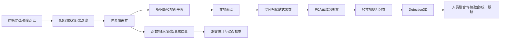
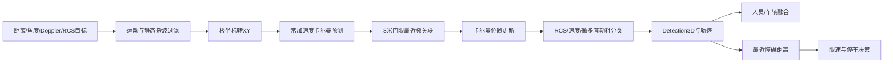

# 环境感知系统后续开发规划报告

设备级模型训练  多设备融合  实机验证与部署

| 项目属性 | 规划内容 |
| --- | --- |
| 项目范围 | RGB  红外热成像  三维LiDAR  四维毫米波  二维LiDAR  环境传感器 |
| 目标平台 | Jetson AGX Orin 与 ROS2 环境 |
| 规划周期 | 建议二十四周 |
| 报告日期 | 2026年9月18日，2026年10月4日更新 |

## 执行摘要

本项目后续开发应先完成可验证的单设备基线，再推进多设备融合。当前架构已经具备传感器同步、独立检测、目标级融合、统一跟踪和风险决策的主体框架，后续工作的重点是建立真实模型后端、完成设备标定、统一数据接口，并形成可复现的训练与验证流程。

- 继续以YOLO11作为当前视觉模型主线，先建立稳定基线，再用YOLO26进行同条件对照。

- RGB火焰烟雾联合模型已经完成D-Fire与Indoor Fire Smoke联合训练并接入系统；近期重点转为真实隧道域验证、困难负样本补强、热成像人员车辆模型和场景微调后的RGB人员车辆模型。

- LiDAR、毫米波、二维LiDAR和环境传感器先采用规则、聚类与跟踪方法，不要求一次训练全部深度模型。

- 公开数据用于预训练和算法验证，最终融合必须依靠小规模实机同步序列完成。

- 验收同时关注精度、召回率、误报警、事件确认延迟、P95推理延迟、显存和设备故障恢复。

## 1 系统实现路线

系统保持输入同步、质量评估、独立检测、统一表示、语义融合、全局跟踪和安全决策七个层次。每种设备先输出自身能够直接证明的结果，再转换为统一的Detection3D数据结构，最后由人员、车辆和火情三个语义融合模块分别处理。

传感器输入  →  时间同步  →  独立检测  →  Detection3D  →  语义融合  →  跟踪定位  →  风险决策

融合前必须满足四个条件：设备时间偏差可测量、所有外参统一到base_link、检测器输出位置和协方差、质量管理模块能够动态降低失效设备的权重。没有真实深度的视觉目标必须明确标记depth_valid为false，避免把单目估计当作真实三维位置。

## 2 当前项目基础与待完善内容

| 模块 | 当前基础 | 下一步 |
| --- | --- | --- |
| RGB | 已接入YOLO11官方人员车辆模型与联合火情模型，支持同帧双模型推理 | 接入真实摄像头/视频，补充隧道困难负样本并评估误报警 |
| 热成像 | 已有温度矩阵和热点时序规则 | 增加人员车辆视觉模型并完成辐射温度标定 |
| 三维LiDAR | 已有降采样 地面分割 聚类与包围盒 | 接入Mid-360实机点云并评估规则上限 |
| 四维毫米波 | 已有过滤 卡尔曼跟踪和粗分类 | 确认设备输出格式并采集实机轨迹 |
| 环境量 | 已有气体和烟雾风险估计 | 完成传感器标定 漂移补偿和时间趋势验证 |
| 融合 | 已有人车火情三条融合链 | 完成外参 标定 关联门限和故障注入测试 |

## 3 不同设备的模型训练与数据集

设备是否需要训练取决于其输出形式和任务。RGB和热成像适合建立独立视觉模型；LiDAR和毫米波首先验证几何与跟踪规则；气体、PM和温湿度传感器重点完成量纲标定、漂移补偿和时间趋势分析。

### 3.1 数据集采用状态

本报告把数据集分成三种状态，避免把“已经用于当前模型”和“以后可能使用”混为一谈。

- **已使用**：数据已经下载或通过官方预训练权重进入项目，并实际参与当前模型训练、测试或系统推理。
- **近期候选**：与当前缺口直接对应，建议在下一阶段下载、检查许可证和标注后使用。
- **条件候选**：仅在确定具体硬件、模型路线或研究问题后使用，不应现在全部下载和训练。

#### 当前已经使用的数据集

| 数据集 | 使用方式 | 当前产物与结果 | 项目位置 |
| --- | --- | --- | --- |
| COCO | 未重新训练；通过Ultralytics官方`yolo11n.pt`预训练权重使用person、car、truck、bus、motorcycle类别 | 当前系统的RGB人员车辆基线模型，与火情模型同帧推理 | `rescue_perception_py/yolo11n.pt` |
| D-Fire | 已清洗并重新划分；类别统一为`0=smoke、1=fire`，保留无火无烟负样本 | 清洗后21,442张图像；联合模型在独立test上Precision 0.766、Recall 0.686、mAP50 0.750、mAP50-95 0.433 | `rescue_perception_py/datasets/D-Fire/clean/` |
| Indoor Fire Smoke | 已按原始来源分组重划分，修正类别顺序和越界框；与D-Fire联合训练 | 5,000张室内正样本；联合模型在独立test上Precision 0.793、Recall 0.702、mAP50 0.789、mAP50-95 0.441 | `rescue_perception_py/datasets/Indoor Fire Smoke/clean/` |
| D-Fire + Indoor联合清单 | 将两个数据域的train和val合并，但保留各自test独立评估 | 当前YOLO11n联合火情模型，权重已接入`YoloBackend` | `rescue_perception_py/datasets/combined_dfire_indoor.yaml` |

当前部署权重为`rescue_perception_py/runs/rgb_fire_smoke/yolo11n_dfire_indoor_joint_sgd/weights/best.pt`。联合训练解决了仅在Indoor数据上顺序微调造成的灾难性遗忘，但公开数据结果仍不能代表真实隧道性能。

#### 可能使用的数据集与采用顺序

| 优先级 | 设备或任务 | 候选数据集 | 建议用途 | 使用前提或限制 |
| --- | --- | --- | --- | --- |
| P0 | RGB火焰烟雾 | MS-FSDB | 增加灯光、夕阳、云雾等困难负样本，重点降低火情误报警 | 先核对VOC标注并转换为项目YOLO类别；与现有test去重 |
| P0 | 隧道火情域验证 | TunnelFire2024 | 作为雾、尾气、烟雾、小火和大火的视频级外部测试集；抽帧建立困难集 | 当前未确认具有目标框，不能直接当YOLO检测训练集；训练前需人工框标注 |
| P0 | RGB人员车辆 | FLIR ADAS RGB、自采机器人视角数据 | 微调COCO基线，适应低视角、隧道灯光、遮挡和远距离小目标 | 必须确认车辆类别标注完整；自采数据按序列划分 |
| P0 | 热成像人员车辆 | FLIR ADAS Thermal | 建立热成像person/car/truck等检测基线 | 固定AGC和归一化流程；温度矩阵与显示热图不可混用 |
| P1 | RGB火焰烟雾 | FASDD | 扩大目标尺度、拍摄距离、无人机和室外场景多样性 | 与隧道机器人视角域差异较大，应控制采样比例并独立报告指标 |
| P1 | 多模态人员 | MID-3K、LLVIP、KAIST | 训练或验证RGB—热成像人员检测，MID-3K还可验证LiDAR深度辅助定位 | 主要是人员标注，不能直接作为车辆或火情联合训练数据 |
| P1 | 环境量火情融合 | MmodalFire | 验证视频、烟雾密度、温度和红外/紫外时序决策融合 | 主要用于事件级融合，不能替代目标框训练数据 |
| P1 | 四维毫米波人员车辆 | View of Delft | 预验证雷达人员车辆检测、相机—LiDAR—雷达标定和融合 | 与计划购买雷达的数据字段、坐标定义和频率一致后再迁移 |
| P2 | 热源分割与温度研究 | IGNITE、FLAME3 | 验证辐射热图的火区分割、温度阈值和RGB—热成像火情融合 | 无人机/野外视角与隧道差异明显，不作为唯一训练来源 |
| P2 | LiDAR人员车辆与跟踪 | JRDB、nuScenes | 预验证三维检测、跟踪、目标关联与评价流程 | 先用现有聚类规则建立基线；只有规则性能不足时才训练深度模型 |
| P2 | 四维毫米波扩展 | TJ4DRadSet、RadarScenes | 三维雷达检测、动态点分类、轨迹和杂波过滤 | 设备格式与目标雷达一致后使用，并检查研究许可 |
| 条件候选 | AWR1843原始雷达张量 | CARRADA | RA、RD和RAD张量检测或分割 | 仅当最终硬件输出ADC/张量而非目标列表时使用 |
| 条件候选 | 气体漂移补偿 | UCI Gas Sensor Array Drift | 预验证漂移补偿和域适应算法 | 不是火灾烟气数据，不能直接用于火灾风险阈值标定 |
| 条件候选 | 多传感器定位与搜救 | UMA-SAR、Oxford Radar RobotCar | 验证rosbag同步、定位、外参和长期鲁棒性 | 不直接替代本项目的隧道同步融合测试集 |

| 设备 | 任务 | 首选数据 | 补充数据 | 首版方法 | 优先级 |
| --- | --- | --- | --- | --- | --- |
| RGB | 人员车辆 | COCO  FLIR RGB | MID-3K RGB  自采数据 | YOLO11n检测 | P0 |
| RGB | 火焰烟雾 | D-Fire + Indoor Fire Smoke（已使用） | MS-FSDB  FASDD  TunnelFire2024  自采负样本 | YOLO11n或YOLO11s | P0 |
| 热成像 | 人员车辆 | FLIR ADAS Thermal | MID-3K  LLVIP  KAIST | YOLO11n检测 | P0 |
| 热成像 | 火源过热 | 实机辐射温度数据 | IGNITE  FLAME3 | 温度规则加分割候选 | P1 |
| 三维LiDAR | 人员车辆障碍 | 自采Mid-360 | JRDB  nuScenes  MID-3K | 聚类规则 后续CenterPoint | P1 P2 |
| 四维毫米波 | 人员车辆跟踪 | VoD  TJ4DRadSet | RadarScenes  自采SR75 | 跟踪规则 后续点云网络 | P1 P2 |
| AWR1843 | RA RD RAD | CARRADA | 自采ADC和点云 | FFT CFAR或张量网络 | 硬件分支 |
| 二维LiDAR | 近场避障 | 实机rosbag | 仿真场景 | 扇区距离和安全阈值 | P0 |
| 环境传感器 | 火情趋势 | 实机标定数据 | MmodalFire  UCI Gas Drift | 阈值 趋势 漂移补偿 | P0 P1 |
| IMU里程计 | 位姿转换 | 实机标定 | UMA-SAR  Oxford Radar RobotCar | 同步 外参 状态估计 | P0 |

### 3.2 RGB人员车辆模型

第一版直接使用YOLO11n的COCO预训练权重验证完整推理链。第二版使用FLIR RGB和实际机器人视角数据微调，类别统一为person、car、truck、bus和motorcycle。MID-3K只有人员标注，不能不加处理地并入五分类联合训练：如果画面中存在未标注车辆，标准YOLO训练会把车辆当成背景。可选择仅用于人员单类预训练、筛选确认无车辆的画面，或补齐车辆标注后再并入联合训练。

- 训练起点  yolo11n.pt

- 建议图像尺寸  640

- 首要指标  人员召回率  车辆召回率  小目标AP  Jetson推理延迟

- 升级条件  YOLO11n召回不足且YOLO11s仍满足实时预算

### 3.3 RGB火焰烟雾模型

火情模型与人员车辆模型分开训练。当前版本已经使用D-Fire和Indoor Fire Smoke完成联合训练：D-Fire提供较多负样本和通用场景，Indoor Fire Smoke补充室内正样本。下一步优先使用MS-FSDB增加标准化困难负样本，用FASDD扩大场景多样性，并把TunnelFire2024作为隧道视频外部测试或人工标注后的微调数据。训练集中必须保留无火无烟负样本，并补充灯光、反光、焊接、蒸汽、灰尘和红色物体等困难样本。

- 检测类别  flame  smoke

- 第一版  YOLO11n检测模型

- 候选升级  YOLO11s或YOLO11n-seg烟雾分割

- 安全指标  Recall优先  同时统计每小时误报警和首次发现时间

### 3.4 热成像人员车辆模型

FLIR ADAS Thermal作为主要训练集，MID-3K、LLVIP和KAIST用于补充移动机器人与低照度行人。单通道热图可复制为三通道输入YOLO11，也可以修改首层卷积，但训练与部署必须保持完全一致的预处理。AGC显示图只能用于视觉检测，不能替代摄氏温度矩阵。

### 3.5 热成像火源与过热设备

首版继续采用辐射温度规则：坏点修复、背景温度估计、人体温区和高温区双阈值、连通域、温升速度、面积增长率和持续时间。IGNITE与FLAME3可用于训练分割候选模型，但最终火源判断仍需回查真实温度矩阵。

### 3.6 红外热成像在系统中的作用与实现原理

#### 3.6.1 设备作用和系统定位

红外热成像相机接收物体自身辐射的红外能量，并将其转换为二维灰度图或温度矩阵。它不依赖可见光照明，因此在夜间、逆光和低照度环境中仍能观察人体、火源及高温设备。对本项目而言，热成像不是RGB相机的简单替代品，而是提供“目标是否具有合理热特征”和“区域温度是否危险”两类独立证据。

热成像在不同检测任务中的具体作用如下。

| 任务 | 热成像能够提供的证据 | 在本系统中的作用 | 主要局限 |
| --- | --- | --- | --- |
| 人员检测 | 人体与背景的温差、人体热轮廓、目标温度范围和温度连续性 | 在夜间或RGB置信度下降时补充人员候选；与RGB、LiDAR和毫米波共同确认人员 | 环境温度接近体表温度、厚重防护服、热源遮挡和玻璃反射会降低可靠性；仅靠温度和轮廓难以区分人形热设备 |
| 车辆检测 | 发动机舱、轮胎、制动器和排气区域的温升，以及车辆整体热轮廓 | 可辅助确认正在运行或刚停止的车辆，并在黑暗中补充RGB证据 | 冷车热特征弱；远距离车辆细节不足；当前代码尚未实现热成像车辆分类模型 |
| 火焰与火源检测 | 高温核心、温度梯度、温升速度、热点面积增长和持续时间 | 为RGB火焰或烟雾检测提供物理温度证据，区分真实火源与灯光、红色物体等视觉误报 | 热成像不能直接可靠识别低温烟雾；高温设备、反射和太阳加热表面可能形成假热点 |
| 过热设备巡检 | 局部温度异常、稳定高温区域和相邻设备温差 | 发现电气柜、轴承、线缆接头等过热区域，生成高温隔离区域 | 需要设备类别、材料发射率、正常温度基线和测距信息；当前巡检模块仍以接口或模拟后端为主 |
| 退化环境感知 | 不受可见光亮度直接影响的热辐射分布 | RGB在低照度或烟雾中降权后，保留人员和火源的辅助观测能力 | 浓烟、蒸汽、雨水和被污染的镜头仍会衰减红外能量，不能认为热成像在所有烟雾条件下都可靠 |

因此，热成像在系统中承担三层职责：第一层是独立产生人体和热点候选；第二层是为人员、火情和设备异常提供温度证据；第三层是在RGB退化时提高系统冗余，但其结果仍需与LiDAR、毫米波、气体传感器或RGB进行交叉确认。

#### 3.6.2 热成像测温原理

常见长波红外热成像相机通过探测目标辐射、环境反射辐射和大气路径辐射形成的总辐射量进行成像。测得的辐射量可简化表示为：

`L_sensor = τ × [ε × L(T_object) + (1 - ε) × L(T_reflected)] + (1 - τ) × L(T_atmosphere)`

其中，`ε`为目标表面发射率，`τ`为大气透过率，`T_object`为目标真实温度，`T_reflected`为反射环境等效温度。相机通过设备标定参数和辐射响应模型把原始数字量转换为温度。由此可知，金属光亮表面、玻璃、距离、湿度和烟雾都会影响测温结果。项目接入真实设备时必须优先获取辐射温度数据或厂商SDK转换后的摄氏度矩阵，不能把AGC伪彩色图像的像素值直接当成温度。

当前数据接口把热成像拆分为两路：

- `thermal_image`：8位显示图或伪彩色图，适合送入YOLO等视觉模型，但像素值通常不代表真实温度。

- `temperature_matrix`：每个像素对应摄氏温度的二维矩阵，适合阈值分割、温升分析和安全风险判断。

这两路数据应保持同一时间戳和像素坐标关系。若设备只能输出原始辐射数字量，还需在驱动层完成坏点表、非均匀性校正、发射率和环境参数补偿，再生成`temperature_matrix`。

#### 3.6.3 当前代码的单帧与时序处理流程


```mermaid
flowchart LR
    A[辐射温度矩阵] --> B[有效性与质量检查]
    B --> C[3×3中值坏点修复]
    C --> D[滑动窗口背景温度估计]
    D --> E[人体温区与高温区双阈值]
    E --> F[八连通区域提取]
    F --> G[温度、面积、形状和梯度特征]
    G --> H[跨帧热点匹配]
    H --> I[温升率、面积增长率和持续时间]
    I --> J[人体／火源／疑似火源／过热设备分类]
    J --> K[Detection3D与热风险等级]
    K --> L[人员融合／火情融合／安全决策]
```

主管线在`PerceptionPipeline.spin_once()`中先评估热成像质量，再调用`ThermalDetector.detect()`，随后把热成像检测结果分别送入人员融合和火情融合模块。当前实现的主要步骤如下。

1. **温度输入检查。** 当`temperature_matrix`为空时直接返回空结果。现阶段核心检测逻辑依赖温度矩阵，而不是显示热图。

2. **坏点修复。** 对每个像素计算3×3邻域中值；若原温度与中值相差超过20摄氏度，则用邻域中值替换。这样可以消除孤立坏点，同时尽量保留真实热边缘。

3. **背景温度估计。** 保存最近30帧温度矩阵，对各像素取时间窗口内最小值，减少短时热点对背景的污染；再使用图像中央区域计算背景均值`μ_bg`和标准差`σ_bg`。

4. **双阈值候选提取。** 人体候选阈值为`T_person = max(24, μ_bg + 3)`摄氏度；高温热点阈值为`T_hot = μ_bg + max(30, 3σ_bg)`摄氏度。人体通道可以保留只比背景高几摄氏度的目标，高温通道用于火源和设备异常。高温区还会向外扩张2个像素，避免火焰周围的温热环带被误判成人体。

5. **连通域和特征计算。** 对候选掩膜执行八连通区域提取，过滤面积过小的区域。每个区域计算最高、平均和最低温度、像素面积、周长、边缘梯度和圆度：`C = 4πA / P²`。其中`A`为区域面积，`P`为周长。

6. **跨帧变化计算。** 以热点质心距离小于25像素为门限与历史热点匹配，计算温升速度`dT/dt`、归一化面积增长率`(A_t - A_(t-1)) / (A_(t-1)Δt)`和持续时间。这些时序量用于区分快速扩张火焰与稳定高温设备。

7. **规则分类。** 当前分类条件主要包括：

   - 人体热候选：区域平均温度在24至44摄氏度之间，同时满足面积和宽高比条件，且不在高温核心影响范围内。
   - 明确火源：最高温度超过200摄氏度、温升速度超过5摄氏度每秒、面积增长率超过0.10每秒且圆度低于0.70。
   - 疑似火源：最高温度超过150摄氏度、温升速度超过3摄氏度每秒且持续超过3秒。
   - 过热设备：最高温度超过80摄氏度、圆度高于0.80且温升速度小于1摄氏度每秒。
   - 温热表面：最高温度超过50摄氏度、变化缓慢且形状较稳定。

8. **统一输出。** 热区域被转换为`Detection3D`，类别可能是人员、火焰、火情候选、高温区域或普通热点，同时携带最高温度、最低温度、像素质心和来源类型。当前二维热图无法直接给出真实深度，因此代码使用配置默认距离生成临时三维位置，并将`depth_valid`设为`false`，明确表示该深度不能作为真实测距结果。

9. **热风险分级。** 根据最高温度和火源候选数量输出0至4级热风险。例如最高温度超过500摄氏度或火源候选不少于3个时进入4级；超过300摄氏度或不少于2个火源候选时进入3级；超过150摄氏度或存在火源候选时进入2级。

#### 3.6.4 人员识别中的工作方式

当前人员识别并不是“看到温度在人体范围就直接判定为人员”，而是分为候选生成和多传感器确认两个阶段。

热成像先根据背景温差、区域面积、宽高比和平均温度产生`PERSON_STANDING`候选，基础置信度为0.60。人员融合模块再检查候选最高温度：24至44摄氏度范围内有效，其中28至42摄氏度获得最高温度有效系数；边缘温区降低置信度，超出范围仅保留较弱证据。随后系统按空间邻近关系关联RGB、热成像、LiDAR和毫米波候选，并综合以下信息：

- RGB提供人员外观类别和二维边界框。

- 热成像提供人体温区与低照度下的热轮廓。

- LiDAR提供真实距离、三维高度、宽度和障碍物轮廓。

- 毫米波提供运动速度、RCS和微多普勒证据。

当至少两个来源给出有效人员证据时，轨迹才被标记为确认目标。重烟环境中RGB权重会显著降低，此时热成像与毫米波运动证据可以把普通障碍提升为人员候选；热成像单独高置信且温度在28至42摄氏度时也可保留人员候选，但不应直接当作完全确认人员。

#### 3.6.5 火情识别中的工作方式

RGB模型擅长识别火焰颜色、烟雾纹理和形态，但容易被灯光、反光、焊接和红色物体误导。热成像则提供火区真实温度、温升和面积增长证据，因此两者具有互补关系。

当前火情融合模块在两米空间邻域内关联RGB火焰或烟雾候选和热热点，并结合气体传感器结果进行分级。典型决策逻辑为：

- RGB与热成像同时达到较高置信度时，可确认为二级以上火情。

- 热成像高置信、温度超过300摄氏度并出现多个热点时，可达到三级火情。

- 极高温、多热点或热成像与窒息性气体风险同时成立时，可达到四级火情。

- 仅有气体火灾特征而没有视觉或热目标时，保留未确认的火情候选，不直接输出确定火源位置。

系统还根据最高温度设置建议高温隔离半径：不超过150摄氏度时为1.5米，超过150、300和500摄氏度时分别扩大到3、5和8米。三级以上火情，或二级且温度超过300摄氏度时，给出停车建议。这里的隔离半径属于工程安全规则，不是由热图直接测量得到的真实火焰范围。

#### 3.6.6 质量评估与动态权重

热成像参与融合前会先计算可信度。当前质量指标由有效温度像素比例、中央区域温度均匀性和温度梯度组成。当可信度低于0.10时热成像权重被置零；0.10至0.30之间按比例降权；可信度恢复后再参与融合。退化状态机还会根据低照度、烟雾程度以及RGB、LiDAR和热成像可信度切换工作模式。

需要注意的是，重烟并不等于热成像必然可靠。当前系统在重烟时降低RGB权重，但仍会根据热成像自身质量动态调节其贡献；若热成像、LiDAR和RGB同时严重退化，则系统进入感知降级状态，更多依赖毫米波和气体传感器，并限制机器人自主运行。

#### 3.6.7 当前实现的不足

| 当前问题 | 具体影响 |
| --- | --- |
| `thermal_image`已进入接口，但热点检测代码实际只使用`temperature_matrix` | 目前没有真正的热成像YOLO人员或车辆模型，代码注释中的模型后端尚未落地 |
| 人员识别依赖温度、面积和宽高比规则 | 对姿态变化、多人粘连、复杂热背景和远距离小目标适应性有限 |
| 没有热成像车辆类别输出 | 热成像尚不能独立识别车辆，只能间接发现高温设备或普通热点 |
| 二维目标使用默认6米距离生成临时坐标 | 与RGB、LiDAR和毫米波进行空间关联时可能产生偏差，虽已用`depth_valid=false`标记，但仍应尽快接入真实深度 |
| 固定温度阈值未考虑材料发射率、反射温度、距离和湿度 | 不同设备、表面材料和环境下可能出现系统性测温偏差 |
| 质心最近邻匹配没有相机运动补偿 | 机器人运动、目标交叉或多个热点靠近时，温升率和面积增长率可能计算错误 |
| 自定义像素级连通域算法复杂度较高 | 接入高分辨率实机热图后可能成为实时性能瓶颈 |
| 质量评分把温度均匀性视为正向指标 | 真实火源会提高区域方差，可能在有效火情画面中反而降低可信度，需要用坏点率、饱和率和时序稳定性替代 |

#### 3.6.8 推荐的完善方案

后续热成像模块应采用“视觉检测分支加辐射测温分支”的双分支结构，而不是完全用深度模型替代温度规则。

1. **设备接入层。** 通过厂商SDK或ROS2驱动同时发布原始辐射数据、摄氏度矩阵、8位显示热图、相机内参、设备温度和时间戳；完成非均匀性校正和坏点表管理。

2. **几何标定层。** 标定热成像内参以及热成像到RGB、LiDAR和`base_link`的外参。将LiDAR点投影到热图，为每个热目标计算中位深度和深度方差；只有获得可靠深度后才设置`depth_valid=true`。

3. **视觉模型分支。** 使用FLIR ADAS训练人员车辆模型，使用MID-3K、LLVIP和KAIST补充人员与低照度场景。第一版继续采用YOLO11n，输入可使用AGC后的单通道图复制为三通道；训练和部署必须使用一致的AGC和归一化策略。

4. **辐射规则分支。** 保留当前背景建模、双阈值、温升率、面积增长率和持续时间规则；增加发射率、环境温度、湿度、距离及饱和像素补偿，并针对人体、火源和设备分别配置阈值。

5. **框内温度统计。** 对YOLO输出框在温度矩阵中计算中位数、最高温度、百分位温度、有效像素率和相对背景温差。人员类别需满足人体温区约束；车辆类别可利用发动机、轮胎和排气热点作为辅助特征；火源类别必须回查真实温度和时序增长。

6. **目标关联和跟踪。** 使用匈牙利匹配与卡尔曼滤波替代简单质心最近邻，并用机器人里程计补偿相机运动。热点轨迹应记录温度曲线、面积曲线、持续时间和来源传感器。

7. **融合与故障处理。** 人员采用RGB、热成像、LiDAR和毫米波目标级融合；火情采用RGB、温度矩阵、气体和PM时序融合；当热成像镜头遮挡、温度饱和或数据超时时自动降权并记录故障原因。

8. **实机验证。** 分别测试夜间人员、静止人员、多人粘连、冷车与热车、稳定高温设备、小火、烟雾遮挡、蒸汽和反射干扰。除mAP和召回率外，还需统计测温误差、每小时误报警、首次报警时间、跨帧温度稳定性和端到端延迟。

#### 3.6.9 代码对应关系

| 实现环节 | 代码文件 | 作用 |
| --- | --- | --- |
| 热成像热点检测 | [`thermal_detector.py`](rescue_perception_py/rescue_perception/detectors/thermal_detector.py) | 坏点修复、背景建模、双阈值分割、连通域、时序特征、热点分类和热风险分级 |
| 参数配置 | [`config.py`](rescue_perception_py/rescue_perception/config.py) | 人体温区、热点阈值、火源阈值、窗口长度和形状参数 |
| 同步输入结构 | [`types.py`](rescue_perception_py/rescue_perception/types.py) | 定义`thermal_image`、`temperature_matrix`、热点类别和统一检测结构 |
| 热成像质量评估 | [`quality_monitor.py`](rescue_perception_py/rescue_perception/management/quality_monitor.py) | 计算有效温度比例、均匀性、梯度和热成像可信度 |
| 人员多传感器融合 | [`person_fusion.py`](rescue_perception_py/rescue_perception/fusion/person_fusion.py) | 用人体温度有效性联合RGB、LiDAR和毫米波确认人员 |
| 火情多传感器融合 | [`fire_fusion.py`](rescue_perception_py/rescue_perception/fusion/fire_fusion.py) | 联合RGB火焰烟雾、热热点和气体风险完成火情分级 |
| 退化与权重管理 | [`degradation_manager.py`](rescue_perception_py/rescue_perception/management/degradation_manager.py) | 根据环境状态和热成像可信度动态调整融合权重 |
| 主管线调用 | [`perception_pipeline.py`](rescue_perception_py/rescue_perception/perception_pipeline.py) | 调用热成像检测，将结果送入人员融合、火情融合、风险评估和安全决策 |

### 3.7 LiDAR和毫米波

#### 3.7.1 两类雷达在系统中的定位

激光雷达和毫米波雷达都可以直接测距，但二者提供的信息和适用环境不同。激光雷达通过高密度三维点云精确描述目标轮廓、尺寸和空间位置；毫米波雷达通过电磁波回波稳定测量距离与径向速度，在烟雾、灰尘、弱光和部分恶劣天气下通常比可见光和激光雷达更稳定。项目采用两者互补：LiDAR负责“目标在哪里、形状多大、是否占道”，毫米波负责“目标是否运动、接近速度多大、近距离是否存在碰撞风险”。

| 检测任务 | 三维LiDAR的作用 | 四维毫米波的作用 | 融合结果 |
| --- | --- | --- | --- |
| 人员检测 | 提供真实三维位置、高度、宽度和点云轮廓，生成`PERSON_CANDIDATE` | 提供距离、速度、RCS和微多普勒人体运动证据 | 与RGB和热成像交叉确认人员并维持轨迹 |
| 车辆检测 | 通过三维尺寸和包围盒识别车辆形障碍，计算车辆宽度 | 通过较强RCS、运动速度和持续轨迹识别车辆形目标 | 输出车辆位置、速度、尺寸和隧道占道比例 |
| 普通障碍与避障 | 分割墙面、地面和非地面物体，精确测量障碍距离与轮廓 | 在低能见度下提供稳定的最近目标距离和接近速度 | 触发限速、停车或远程确认 |
| 烟雾与感知退化 | 点数减少、最大有效距离下降、近场散射和强度衰减可作为烟雾辅助证据 | 对烟雾通常不敏感，可在LiDAR和RGB退化时保留运动目标观测 | 动态调整LiDAR、毫米波和其他设备的融合权重 |
| 火情检测 | 不测温，也不能直接确认火焰；可描述火区周围障碍和通行空间 | 不直接识别火焰；用于火场中的人员运动和近障碍安全监控 | 为救援路径和安全决策提供几何冗余，不替代热成像和气体传感器 |
| 巡检与建图 | 提供隧道几何、地面、墙面和设施的三维结构 | 提供恶劣条件下的定位和运动约束 | 支持地图定位、设备外参和巡检结果定位 |

二维LiDAR与三维LiDAR的职责也不同。前后二维LiDAR适合在固定扫描平面内进行近场防撞和安全冗余，三维LiDAR则用于三维目标尺寸、地面分割、语义融合与地图定位。当前系统虽然定义了二维LiDAR输入和权重，但尚未实现独立的二维扫描避障模块。

#### 3.7.2 激光雷达测距与点云原理

激光雷达发射激光脉冲并测量回波往返时间。飞行时间测距可简化为：

`R = c × Δt / 2`

其中`R`是目标距离，`c`是光速，`Δt`是激光从发射到接收的往返时间。结合水平角`θ`和垂直角`φ`，可将量测转换为三维点：

`x = R cosφ cosθ`  
`y = R cosφ sinθ`  
`z = R sinφ`

每个点还可能包含反射强度、回波序号和时间戳。反射强度与距离、材料反射率、入射角、烟雾散射和设备增益有关，不能直接当作目标类别。旋转式或多线LiDAR连续输出点云帧，机器人运动时还需要使用IMU或里程计进行点云去畸变，否则同一帧内不同时间采集的点会产生位置偏差。

LiDAR的优势是测距精度高、轮廓清晰、输出天然位于三维坐标系；不足是缺少颜色和温度语义，远距离点云稀疏，黑色或镜面材料可能弱回波，浓烟、粉尘和水雾会产生散射或衰减。

#### 3.7.3 当前三维LiDAR处理流程


```mermaid
flowchart LR
    A[原始XYZ/强度点云] --> B[0.5至80米距离滤波]
    B --> C[体素降采样]
    C --> D[RANSAC地面平面]
    D --> E[非地面点]
    E --> F[空间哈希欧式聚类]
    F --> G[PCA三维包围盒]
    G --> H[尺寸规则粗分类]
    H --> I[Detection3D]
    C --> J[点数/散射/距离/衰减质量]
    I --> K[人员融合/车辆融合/统一跟踪]
    J --> L[烟雾估计与动态权重]
```

`LidarCluster.cluster()`把原始点云转换为地面点、障碍物候选和点云质量指标，具体过程如下。

1. **距离直通滤波。** 计算每个点到LiDAR原点的欧氏距离，只保留0.5至80米范围内的点，排除车体自身回波、异常近点和超量程噪声。

2. **体素降采样。** 按三维体素索引对点分桶，每个体素使用点的均值表示。正常模式体素边长为0.1米；重烟模式使用0.3米以降低点云处理量和随机散射影响。该实现保留XYZ之外的附加通道均值，例如反射强度。

3. **RANSAC地面分割。** 随机选取3点拟合`z = ax + by + c`地面平面，重复100次，距离平面小于0.05米的点作为地面内点。最大内点模型作为地面，剩余点用于障碍聚类。

4. **欧式聚类。** 使用空间哈希把点分配到规则网格，仅搜索相邻27个网格，减少全量两两距离计算。正常模式聚类距离为0.3米，重烟模式放宽到0.5米；少于20个点的区域被过滤。

5. **PCA包围盒。** 对每个聚类计算协方差矩阵并进行特征分解，主特征向量给出目标主方向，点在主轴上的跨度形成长度、宽度和高度，水平方向主轴计算偏航角。与轴对齐包围盒相比，PCA包围盒更适合倾斜停放的车辆。

6. **尺寸规则粗分类。** 长度大于2米、宽度大于1.2米且高度大于1米时标记为未知车辆；高度大于0.5米且水平面积小于0.5平方米时标记为人员候选；其他区域标记为普通障碍物。该分类只能提供几何候选，不能替代视觉语义分类。

7. **质量评估。** 当前代码计算相对于标称3万点的有效点比例、1米内低强度散射比例、距离95百分位以及反射强度随距离衰减的斜率。这些指标进入`QualityMonitor`和烟雾估计模块，用于判断LiDAR是否衰减并动态降低其权重。

8. **统一输出。** 每个聚类输出三维中心、尺寸、偏航角、类别、置信度和点数，作为`Detection3D`送入人员融合、车辆融合及统一语义跟踪器。地面点另外提供给裂缝和积水等巡检接口。

#### 3.7.4 毫米波雷达测距、测速与测角原理

项目面向FMCW毫米波雷达。雷达连续发射频率随时间线性变化的啁啾信号，将接收回波与当前发射信号混频得到拍频。若啁啾斜率为`S`，静止目标距离近似为：

`R = c × f_b / (2S)`

其中`f_b`为距离拍频。连续多个啁啾之间的相位变化形成多普勒频率`f_d`，径向速度近似为：

`v_r = λ × f_d / 2`

其中`λ`为雷达波长。不同接收天线之间的相位差用于估计方位角和俯仰角。能够同时输出距离、方位角、俯仰角和径向速度的目标点或点云通常称为四维毫米波雷达数据。

雷达回波还包含RCS，即目标对雷达的等效反射强度。车辆金属结构通常RCS较强，但RCS同时受距离、姿态、材料、遮挡和设备标定影响，因此只能作为辅助特征。人体肢体摆动会产生围绕主体速度的微多普勒变化，可辅助区分人员与刚性物体，但需要原始多普勒谱或设备已提取的微多普勒特征。

本项目涉及两条毫米波技术路线：

- **SR75式四维目标点或目标列表。** 设备侧已完成FFT、检测和测角，系统接收`range`、`azimuth`、`elevation`、`doppler`、`rcs`或XYZ目标点。当前`RadarTracker`属于这条路线。

- **AWR1843原始ADC或RA、RD、RAD张量。** 系统需要自行执行距离FFT、多普勒FFT、角度估计、CFAR和聚类，也可训练张量检测网络。CARRADA适合这一分支。原始ADC模型不能直接用于设备已经输出的稀疏四维点云。

#### 3.7.5 当前毫米波目标处理流程


```mermaid
flowchart LR
    A[距离/角度/Doppler/RCS目标] --> B[运动与静态杂波过滤]
    B --> C[极坐标转XY]
    C --> D[常加速度卡尔曼预测]
    D --> E[3米门限最近邻关联]
    E --> F[卡尔曼位置更新]
    F --> G[RCS/速度/微多普勒粗分类]
    G --> H[Detection3D与轨迹]
    H --> I[人员/车辆融合]
    H --> J[最近障碍距离]
    J --> K[限速与停车决策]
```

`RadarTracker.track()`维护跨帧雷达轨迹，主要步骤如下。

1. **输入转换。** 若设备直接提供`x`、`y`、`z`则直接使用；否则根据距离、方位角和俯仰角计算三维坐标。水平距离为`r cosφ`，随后计算`x = r cosφ cosθ`、`y = r cosφ sinθ`和`z = r sinφ`。

2. **杂波过滤。** 径向速度绝对值大于0.1米每秒的运动目标直接保留；RCS大于0的强回波也直接保留；其余静态弱目标按照距离和方位角量化成网格，连续出现至少5帧后保留。这样既抑制瞬时杂波，也允许墙面、停放车辆等持续静态障碍进入系统。

3. **状态预测与速度观测。** 水平内部状态为`[x, y, vx, vy, ax, ay]`，状态转移按照常加速度形式传播；高度和垂直速度单独平滑。新轨迹使用Doppler初始化径向速度，匹配轨迹再把Doppler作为卡尔曼速度观测，避免完全依赖多帧位置差估速。

4. **数据关联。** 每个当前目标在3米门限内选择最近且尚未使用的轨迹，形成一对一贪心匹配。匹配目标用二维位置执行卡尔曼更新；未匹配且RCS不低于-10 dB的目标创建新轨迹。

5. **轨迹维持。** 没有匹配的轨迹进入滑行状态，最多保留10帧；滑行轨迹置信度乘0.8。这样可以跨越短时漏检，但不能长期依赖预测目标。

6. **粗分类。** 系统兼容设备直接提供的微多普勒布尔标志，也能根据`micro_doppler_amplitude`和配置阈值生成标志。当存在微多普勒且RCS位于-5至10 dB范围时标记为人员候选；RCS大于10 dB时标记为未知车辆；其余依据RCS和速度标记为不同类型的普通障碍物。

7. **轨迹置信度。** 单目标置信度随连续观测帧数从0.50逐步提高，最高为0.70；滑行轨迹再乘0.8。环境模式不会直接修改单目标置信度，毫米波在重烟中的优势通过融合权重单独体现，避免把环境先验误当作测量精度。

8. **最近障碍距离。** 每帧计算所有雷达轨迹中最近的水平距离。小于5米触发减速警告，小于3米进入低速谨慎状态，小于1米要求停车并等待确认。

#### 3.7.6 人员、车辆和障碍融合方式

**人员融合。** LiDAR候选需要满足约0.3至1.0米宽、0.3至2.0米高等尺寸条件；毫米波候选根据速度、RCS和微多普勒计算证据分数。系统把RGB、热成像、LiDAR和毫米波目标投影到统一空间，在关联门限内组合置信度。至少两个传感器给出有效证据时，人员目标才被确认。重烟时RGB权重下降，热成像加毫米波运动证据可以保留人员候选，LiDAR仍可在点云质量允许时提供三维尺寸。

**车辆融合。** RGB负责输出汽车、公交车、卡车等具体类别；LiDAR负责车辆三维尺寸和方向；毫米波负责强RCS和速度。系统以2米邻域关联三类证据：RGB加LiDAR或毫米波可形成确认车辆；只有LiDAR和毫米波时输出`VEHICLE_UNKNOWN`；仅有毫米波时输出未确认的大型障碍。车辆宽度除以默认3.5米车道宽度得到占道比例，超过0.3判为部分阻塞，超过0.7判为高风险阻塞。

**普通障碍和安全冗余。** LiDAR可以发现静态障碍并给出尺寸，毫米波可以发现运动目标和持续强反射障碍。毫米波最近距离直接进入风险评估，即使语义类别不确定，也能触发减速或停车。因此安全层不应等待“确定是人员或车辆”后才采取避障动作。

#### 3.7.7 点云质量、退化模式和动态权重

系统先评估数据质量，再决定融合权重。LiDAR可信度由有效点比例、近场散射、最大量程和强度衰减组成；毫米波可信度由最近10帧目标数量稳定性和RCS方差组成。正常模式中RGB和LiDAR权重较高；低能见度时增加热成像和毫米波权重；重烟时进一步降低RGB与LiDAR权重，提高毫米波和气体传感器权重；感知严重退化时可将RGB和LiDAR置零，依靠毫米波、二维LiDAR和环境传感器维持最低安全能力。

这种策略的关键是把“传感器物理能力”和“本帧数据是否正常”分开。毫米波理论上耐烟雾，并不表示某一帧雷达数据一定可靠；LiDAR理论上精确，也不表示在玻璃、黑色材料或浓烟环境中不会失效。因此每种传感器都必须有独立健康状态、同步误差和降权机制。

#### 3.7.8 当前实现的不足

| 当前问题 | 具体影响 |
| --- | --- |
| 当前LiDAR分类完全依赖固定尺寸规则 | 人员、车辆、设备和不规则障碍容易混淆，类别能力明显弱于PointPillars或CenterPoint |
| RANSAC只拟合单个`z=ax+by+c`平面 | 隧道坡道、台阶、多层地面和机器人姿态变化时可能错误分割地面 |
| 点云未进行运动去畸变 | 机器人运动或快速转弯时，目标形状和包围盒可能拉伸 |
| LiDAR质量使用固定标称3万点归一化 | 不同设备、转速、视场裁剪和遮挡情况下不可直接比较，需要按设备建立动态基线 |
| 毫米波已使用俯仰角生成高度，但高度和垂直速度尚未进入统一卡尔曼状态 | 目前属于二维常加速度跟踪加独立高度平滑，还不是完整三维状态估计 |
| Doppler已作为水平径向速度观测，但尚未联合设备速度协方差和自车运动补偿 | 转弯、侧向运动和低速目标的速度精度仍需通过实机标定验证 |
| 微多普勒支持设备布尔结果或幅值阈值 | 系统仍未从原始多普勒谱提取周期和人体步态特征 |
| 雷达关联采用3米门限贪心最近邻 | 多目标交叉、密集交通和虚警较多时容易发生轨迹ID切换，应改为带速度门控的匈牙利或JPDA关联 |
| 二维LiDAR已实现前后正向扇区和三级近障碍告警 | 尚未使用机器人速度计算TTC，也未实现连续占用防抖和传感器盲区建模 |
| 传感器到地图的外参默认均为单位矩阵 | 未加载实机标定时，LiDAR、毫米波、RGB和热成像目标可能错误关联或定位 |

#### 3.7.9 推荐的完善方案

1. **先完成真实驱动和数据定义。** 明确Mid-360点云字段、时间基准、坐标轴和反射强度；明确SR75输出的是目标列表还是点云，以及距离、角度、速度、RCS、SNR、目标ID和协方差字段。AWR1843原始ADC分支单独设计，不与SR75目标列表混用。

2. **完成时空标定。** 标定LiDAR到`base_link`、毫米波到`base_link`以及相机与雷达之间的外参；测量设备时间偏差。融合前统一到同一时刻和坐标系，并对机器人运动进行补偿。

3. **完善三维LiDAR预处理。** 增加ROI裁剪、自车点删除、统计离群点过滤和点云去畸变；依据隧道坡度与IMU姿态改进地面分割，可采用法向量约束RANSAC、渐进形态学或Patchwork++。

4. **建立规则基线后再训练模型。** 先保留现有聚类与尺寸规则作为可解释基线；若人员车辆分类不足，再使用JRDB、nuScenes和自采Mid-360数据训练PointPillars或CenterPoint。最终测试必须包含隧道自采数据，以验证跨设备和跨场景泛化。

5. **继续完善雷达状态估计。** 当前已把Doppler加入水平径向速度更新，并使用俯仰角生成高度；下一步把高度、垂直速度、自车速度和设备协方差统一加入扩展卡尔曼滤波，关联代价同时使用位置、径向速度、RCS、类别和时间差。

6. **区分点云雷达和原始张量雷达。** 对SR75类四维点云可使用DBSCAN、PointNet或专用雷达点云网络；对AWR1843原始ADC依次执行距离FFT、静态杂波抑制、多普勒FFT、CFAR、角度估计和聚类，也可使用CARRADA训练RA、RD或RAD张量网络。

7. **继续完善二维LiDAR安全链。** 当前已实现前后正向扇区、有效量测率、2米警告、1米停车和0.6米紧急级别，并已接入统一安全决策。下一步加入机器人速度、TTC、连续占用防抖、盲区建模和独立硬件急停接口。

8. **完善融合与协方差。** 每个检测输出位置、速度和尺寸协方差。使用马氏距离门控和匈牙利匹配进行目标级融合；无法确认类别但距离很近的目标仍按障碍处理。语义跟踪器应避免车辆融合每帧重新分配局部ID造成轨迹不稳定。

9. **建立实机评价指标。** LiDAR统计地面分割IoU、聚类召回率、3D框误差、距离误差、点云处理延迟和烟雾下有效距离；毫米波统计距离误差、速度误差、虚警率、漏检率、轨迹ID切换、首次发现距离和TTC误差；融合层统计人员车辆召回率、占道判断准确率及传感器故障恢复时间。

#### 3.7.10 代码对应关系

| 实现环节 | 代码文件 | 作用 |
| --- | --- | --- |
| 三维点云处理 | [`lidar_cluster.py`](rescue_perception_py/rescue_perception/detectors/lidar_cluster.py) | 距离滤波、体素降采样、RANSAC地面分割、欧式聚类、PCA包围盒、尺寸分类和点云质量统计 |
| 二维近场安全 | [`lidar2d_safety.py`](rescue_perception_py/rescue_perception/detectors/lidar2d_safety.py) | 解析前后扫描、正向扇区测距、有效率统计、三级近障碍告警和阻塞扇区输出 |
| 毫米波目标跟踪 | [`radar_tracker.py`](rescue_perception_py/rescue_perception/detectors/radar_tracker.py) | 杂波过滤、坐标转换、常加速度卡尔曼跟踪、RCS与微多普勒粗分类、最近障碍距离 |
| 人员融合 | [`person_fusion.py`](rescue_perception_py/rescue_perception/fusion/person_fusion.py) | 联合LiDAR尺寸、毫米波RCS/速度/微多普勒以及RGB和热成像证据 |
| 车辆融合 | [`vehicle_fusion.py`](rescue_perception_py/rescue_perception/fusion/vehicle_fusion.py) | 联合RGB类别、LiDAR三维尺寸和毫米波强回波，计算车辆占道比例 |
| 质量评估 | [`quality_monitor.py`](rescue_perception_py/rescue_perception/management/quality_monitor.py) | 计算LiDAR有效率、散射和量程，以及毫米波目标数量与RCS稳定性 |
| 烟雾估计 | [`smoke_estimator.py`](rescue_perception_py/rescue_perception/detectors/smoke_estimator.py) | 将LiDAR有效率、最大量程和近场散射与图像、PM和CO联合估计烟雾 |
| 动态权重 | [`degradation_manager.py`](rescue_perception_py/rescue_perception/management/degradation_manager.py) | 在正常、低能见度、重烟和感知降级模式间调整LiDAR、毫米波和二维LiDAR权重 |
| 坐标转换 | [`semantic_localizer.py`](rescue_perception_py/rescue_perception/fusion/semantic_localizer.py) | 将融合测量从LiDAR或毫米波坐标系转换到统一地图坐标并传播协方差 |
| 风险与安全 | [`risk_assessor.py`](rescue_perception_py/rescue_perception/management/risk_assessor.py) | 联合毫米波与二维LiDAR最近距离和车辆占道信息生成减速、停车与远程确认建议 |
| 主管线调用 | [`perception_pipeline.py`](rescue_perception_py/rescue_perception/perception_pipeline.py) | 调用LiDAR聚类和毫米波跟踪，将结果送入融合、跟踪、风险和安全模块 |

#### 3.7.11 本轮系统完善状态

| 完善内容 | 实现结果 | 验证方式 |
| --- | --- | --- |
| LiDAR最大聚类限制 | `max_cluster_size`现在真正参与欧式聚类过滤，避免超大墙面聚类进入分类 | 新增超大聚类单元测试 |
| 二维LiDAR独立安全链 | 新增前后扫描解析、正向扇区最小距离、有效率、阻塞扇区和0至3级告警 | 新增扇区过滤及0.8米停车级测试 |
| 二维LiDAR接入安全决策 | 二维LiDAR与毫米波最近距离共同决定障碍风险、减速和停车 | 新增0.4米障碍触发`SAFETY_STOP_REQUIRED`主管线测试 |
| 二维LiDAR质量评估 | 不再复用三维点云质量，改为按各扫描有效距离量测比例独立计算可信度 | 完整主管线回归测试 |
| 毫米波高度 | 支持直接XYZ输入，也支持由距离、方位角和俯仰角计算三维位置 | 新增俯仰角高度测试 |
| 毫米波Doppler | 新建轨迹时初始化径向速度，匹配轨迹时把Doppler作为卡尔曼速度观测 | 新增2米每秒径向速度测试 |
| 微多普勒兼容 | 同时接受设备布尔标志和`micro_doppler_amplitude`幅值阈值 | 新增幅值阈值测试 |
| 置信度与环境权重解耦 | 重烟不再直接提高单目标雷达置信度，环境优势只通过动态融合权重体现 | 全量回归与合成场景演示 |

本轮修改完成后，项目共执行29项自动化测试，全部通过；合成隧道火灾端到端演示也能正常运行。该结果证明软件链路闭环，但不能替代Mid-360、四维毫米波和前后二维LiDAR实机测试。

## 4 数据准备与训练规范

### 4.1 数据划分

所有视频型数据按采集序列划分训练集、验证集和测试集，建议比例为70比15比15。同一视频的相邻帧不得跨集合。公开测试集用于论文可比性，自采测试集用于评估真实设备与应用场景。

### 4.2 数据质量检查

- 检查损坏图像 空标签 越界框 重复图像和错误类别编号。

- 使用感知哈希识别跨数据集重复图像，避免训练测试泄漏。

- 统计每类图像数和实例数，处理严重类别不平衡。

- 对火情数据单独建立困难负样本集。

- 记录来源 许可证 下载日期 转换脚本 哈希和划分清单。

### 4.3 训练实验规范

每个正式模型至少使用三个随机种子重复训练，保存best和last权重、完整配置、数据版本、软件环境和评估结果。YOLO11与YOLO26对照时仅改变模型版本，其余数据、增强、图像尺寸、训练轮数和部署精度保持一致。

### 4.4 使用公开数据集进行模型训练

以下命令遵循[Ultralytics YOLO11官方说明](https://docs.ultralytics.com/models/yolo11/)和[Train模式文档](https://docs.ultralytics.com/modes/train/)。正式训练前应固定Ultralytics、PyTorch和CUDA版本，并把环境信息写入实验记录。

#### 4.4.1 先按任务拆分模型

本项目不应把人员、车辆、火焰、烟雾和所有传感器数据直接合成一个训练集。不同任务的成像规律、类别标注和误报来源不同，建议至少建立以下独立模型。

| 模型 | 输入 | 类别 | 首选数据集 | 第一版模型 |
| --- | --- | --- | --- | --- |
| RGB人员车辆 | 可见光RGB | person、car、truck、bus、motorcycle | COCO预训练，FLIR RGB与自采数据微调 | YOLO11n Detect |
| RGB火情 | 可见光RGB | flame、smoke | D-Fire、FASDD、自采困难负样本 | YOLO11n Detect |
| 热成像人员 | AGC热图 | person | FLIR Thermal、MID-3K、LLVIP、KAIST | YOLO11n Detect |
| 热成像车辆 | AGC热图 | car、truck、bus、motorcycle | FLIR Thermal及自采数据 | YOLO11n Detect，可在人员模型稳定后合并 |
| 热源分割候选 | 辐射热图或统一显示热图 | fire区域或高温区域 | IGNITE、FLAME3、自采辐射温度数据 | YOLO11n-seg或温度规则 |
| LiDAR三维检测 | 三维点云 | person、vehicle、obstacle | JRDB、nuScenes、自采Mid-360 | 先用聚类规则，后续PointPillars或CenterPoint |
| 四维毫米波检测 | 雷达点云或目标列表 | person、vehicle、background | View of Delft、TJ4DRadSet、自采数据 | 先用跟踪规则，后续雷达点云网络 |

首轮训练只需要完成前三个视觉模型。LiDAR、毫米波和热源判断已有规则基线，可在系统闭环后根据实验结果决定是否训练深度模型。

#### 4.4.2 下载后建立数据登记表

每个数据集下载后先记录数据集名称、版本、来源链接、许可证、下载日期、文件哈希、传感器类型、类别、标注格式、采集序列和允许用途。原始数据目录只读保存，所有格式转换和划分结果写入派生目录，不能直接修改原始数据。

推荐目录如下：

```text
datasets/
├── raw/
│   ├── coco/
│   ├── flir_adas/
│   ├── mid3k/
│   ├── dfire/
│   └── ...
├── prepared/
│   ├── rgb_person_vehicle/
│   ├── rgb_fire_smoke/
│   ├── thermal_person/
│   └── thermal_vehicle/
├── manifests/
│   ├── source_registry.csv
│   ├── class_mapping.yaml
│   └── split_manifest.csv
└── checksums/
```

#### 4.4.3 统一类别定义

不同数据集的类别名称必须先映射为项目统一类别。例如COCO的`motorcycle`、部分数据集的`motorbike`和`motorcyclist`不能未经确认直接合并；`fire`和`flame`可以统一为`flame`，但`smoke`必须保持独立类别。

RGB人员车辆模型建议使用：

```yaml
names:
  0: person
  1: car
  2: truck
  3: bus
  4: motorcycle
```

RGB火情模型建议使用：

```yaml
names:
  0: flame
  1: smoke
```

类别映射必须由转换脚本显式完成，不能仅按原始类别编号拼接，因为不同数据集中的类别0通常表示完全不同的对象。

#### 4.4.4 转换为YOLO检测格式

每张图像对应一个同名`.txt`标签文件，每个目标占一行：

```text
class_id x_center y_center width height
```

坐标均除以图像宽高归一化到0至1。没有目标的真实负样本应保留空标签文件。转换后目录建议为：

```text
rgb_fire_smoke/
├── images/
│   ├── train/
│   ├── val/
│   └── test/
├── labels/
│   ├── train/
│   ├── val/
│   └── test/
└── data.yaml
```

`data.yaml`示例：

```yaml
path: /absolute/path/to/datasets/prepared/rgb_fire_smoke
train: images/train
val: images/val
test: images/test
names:
  0: flame
  1: smoke
```

转换后必须检查图像与标签一一对应、类别编号范围、归一化坐标、零面积框、越界框、重复框和损坏图像，并随机可视化至少200张带框图像。

#### 4.4.5 处理“部分标注”问题

这是多数据集训练中最容易被忽视的问题。标准目标检测训练把没有标注框的区域当作背景。如果一个人员数据集的图片中实际存在车辆但没有车辆框，将其直接加入人员车辆联合训练会产生错误监督。

处理方式按优先级排序：

1. 补齐目标任务涉及的全部类别标注。

2. 将部分标注数据用于人员单类模型预训练，再使用完整标注数据训练联合模型。

3. 只选择已确认不含缺失类别的图像。

4. 若训练框架支持忽略区域或缺失类别掩码，可明确配置；当前标准Ultralytics YOLO流程不能自动理解“这张图只标了人员”。

因此MID-3K、LLVIP和KAIST更适合热成像人员模型；FLIR ADAS更适合人员车辆联合模型。TunnelFire2024主要是视频场景数据，若没有火焰烟雾目标框，应作为外部测试集或人工抽帧标注后再训练，不能把视频级场景名称直接当作检测框。

#### 4.4.6 按采集序列划分数据

视频相邻帧或同一采集序列高度相似，必须先按序列分组，再按约70%、15%、15%划分训练、验证和测试集。同一视频、同一天连续采集或同一火灾实验的帧不能跨集合。公开数据用于训练和通用测试，自采隧道数据至少保留一个完全不参与调参的最终测试集。

合并多个数据集时建议保留`source_dataset`、`sequence_id`和`original_path`字段，以便分别统计每个数据域的指标。不能只报告混合测试集总mAP，否则可能掩盖隧道域性能不足。

#### 4.4.7 RGB人员车辆模型训练

第一阶段直接验证官方COCO预训练权重，不重新训练COCO。第二阶段使用FLIR RGB、类别完整的自采数据以及必要的困难样本进行微调。

```bash
cd /home/ubuntu/桌面/环境感知/rescue_perception_py
python3 -m pip install -e '.[yolo]'

yolo detect train \
  model=yolo11n.pt \
  data=/absolute/path/to/rgb_person_vehicle/data.yaml \
  epochs=100 imgsz=640 batch=16 device=0 workers=8 \
  project=runs/rgb_person_vehicle name=yolo11n_seed0 \
  seed=0 patience=25 plots=True
```

显存不足时先降低`batch`，不要首先降低图像尺寸；隧道远距离人员通常是小目标，过低分辨率会明显降低召回率。完成后使用不同随机种子重复训练，例如0、1和2。

#### 4.4.8 RGB火焰烟雾模型训练

当前基线使用D-Fire与Indoor Fire Smoke联合训练，下一轮优先加入MS-FSDB困难负样本，并使用自采数据补充隧道灯光、红色标志、反光、焊接、蒸汽、灰尘和无火场景；FASDD只作为控制比例的场景扩展数据。无火无烟图像应保留空标签，这是降低误报警的重要数据。

```bash
yolo detect train \
  model=yolo11n.pt \
  data=/absolute/path/to/rgb_fire_smoke/data.yaml \
  epochs=150 imgsz=640 batch=16 device=0 workers=8 \
  project=runs/rgb_fire_smoke name=yolo11n_seed0 \
  seed=0 patience=30 plots=True
```

火情模型不能只看mAP，应额外统计火焰召回率、烟雾召回率、每小时误报警、无火困难集误报率和视频首次报警时间。烟雾边界模糊，如果框检测效果不稳定，可在完成检测基线后对烟雾单独尝试YOLO11分割模型。

#### 4.4.9 热成像人员车辆模型训练

辐射温度矩阵应保留用于温度规则；YOLO输入使用固定预处理得到的8位热图。若模型需要三通道输入，可把同一灰度通道复制三份。训练、验证和部署必须使用相同的AGC、温度裁剪范围和归一化方式，否则模型输入分布会发生变化。

热成像人员模型先使用FLIR Thermal、MID-3K、LLVIP和KAIST训练单类`person`。车辆模型先只使用FLIR中具有完整车辆标注的数据。两个模型分别稳定后，再使用类别完整的数据训练联合人员车辆模型。

```bash
yolo detect train \
  model=yolo11n.pt \
  data=/absolute/path/to/thermal_person/data.yaml \
  epochs=120 imgsz=640 batch=16 device=0 workers=8 \
  project=runs/thermal_person name=yolo11n_seed0 \
  seed=0 patience=25 plots=True
```

常规HSV颜色增强不适合单通道热图，应关闭或显著减小色相与饱和度增强；几何翻转、缩放、裁剪和适度噪声仍可使用。最终还要在真实设备热图上评估，因为不同相机AGC和响应曲线存在明显域差异。

#### 4.4.10 验证、恢复与导出

训练结束后使用`best.pt`在从未参与调参的测试集上评估：

```bash
yolo detect val \
  model=runs/rgb_fire_smoke/yolo11n_seed0/weights/best.pt \
  data=/absolute/path/to/rgb_fire_smoke/data.yaml \
  split=test imgsz=640 device=0 plots=True
```

训练中断后从`last.pt`恢复：

```bash
yolo detect train \
  model=runs/rgb_fire_smoke/yolo11n_seed0/weights/last.pt \
  resume=True
```

在训练电脑上完成精度验证后，再针对Jetson导出TensorRT。TensorRT引擎通常与导出设备、TensorRT版本和精度模式相关，建议在目标Jetson环境生成：

```bash
yolo export \
  model=runs/rgb_person_vehicle/yolo11n_seed0/weights/best.pt \
  format=engine imgsz=640 half=True device=0
```

导出后必须重新验证输出类别、置信度、NMS结果、FP16精度变化、P50/P95延迟、显存占用和连续运行稳定性。

#### 4.4.11 接入当前项目

当前[`YoloBackend`](rescue_perception_py/rescue_perception/detectors/yolo_backend.py)已经实现双模型接入，配置中使用两个独立路径：

1. `model_path`指向官方`yolo11n.pt`，负责人员和常见车辆。

2. `fire_smoke_model_path`指向联合模型`runs/rgb_fire_smoke/yolo11n_dfire_indoor_joint_sgd/weights/best.pt`，负责火焰和烟雾。

3. 两个模型在同一帧分别推理，后端把`person/car/truck/bus/motorcycle/fire/flame/smoke`映射为系统`ObjectClass`，合并后进入`RgbDetector`；烟雾框同时生成覆盖率、最高概率和质心，提供给烟雾多源估计模块。

后续替换任一权重时，必须检查模型类别名称和顺序，分别在人员车辆测试集、D-Fire test、Indoor test、隧道外部测试集及困难负样本集上复验，不能只验证混合验证集。

热成像模型也不能直接放入当前`ThermalDetector`。应新增热成像视觉后端，把YOLO框与同像素位置的`temperature_matrix`关联：模型负责人员车辆外观分类，温度矩阵负责框内最高温度、平均温度和背景温差，二者共同生成热成像`Detection3D`。

#### 4.4.12 建议的训练验收顺序

1. **已完成：**用官方`yolo11n.pt`跑通RGB人员车辆推理链。

2. **已完成：**完成D-Fire与Indoor Fire Smoke清洗、联合训练、独立测试和双模型系统接入。

3. **下一步：**使用MS-FSDB和自采隧道无火场景补充困难负样本，在TunnelFire2024上开展视频外部测试。

4. 完成热成像人员单类模型训练。

5. 用自采隧道数据微调RGB人员车辆模型。

6. 分别在公开测试集、自采测试集和困难负样本集上验收三个模型。

7. 接入热成像视觉后端，再进行RGB、热成像、LiDAR、毫米波与环境量同步融合验证。

8. 只有当规则LiDAR或毫米波方法达不到召回率和误报要求时，再训练三维点云或雷达深度模型。

## 5 多设备融合方案

### 5.1 统一输出接口

所有检测器输出Detection3D，字段至少包括时间戳、类别、置信度、传感器来源、位置、速度、尺寸、方位角、协方差和附加特征。模型内部类别编号先映射为系统ObjectClass，再进入融合模块。

### 5.2 人员融合

RGB提供语义类别，热成像提供人体温区，LiDAR提供三维位置和尺寸，毫米波在烟雾遮挡下提供速度与轨迹。系统先通过空间门控和匈牙利匹配完成关联，再依据传感器质量动态加权。正常情况下至少需要两类独立证据确认人员，重烟时允许热成像与毫米波替代RGB。

### 5.3 车辆融合

RGB确定车辆类别，LiDAR提供车辆长度、宽度、高度和占道比例，毫米波提供距离、速度和高RCS证据。车辆目标与火情事件可以同时存在，因此车辆框与车辆内部火焰框不得执行跨类别抑制。

### 5.4 火情融合

RGB火焰和烟雾仅生成视觉候选，热成像提供高温及温升物理证据，PM和气体提供环境趋势。火情事件采用无事件、疑似、确认、高危和恢复状态机，并设置进入与退出迟滞，降低单帧误报警。

| 目标 | 证据来源 | 融合方法 | 输出 |
| --- | --- | --- | --- |
| 人员 | RGB 热成像 LiDAR 毫米波 | 空间关联 类别一致性 动态权重 | 至少两类证据确认 |
| 车辆 | RGB LiDAR 毫米波 | 类别 尺寸 RCS 速度 | 输出车辆类别和占道风险 |
| 火情 | RGB 热成像 PM 气体 | 视觉候选 温度 趋势 状态机 | 物理证据确认并计算风险 |
| 烟雾 | RGB PM 气体 LiDAR | 覆盖率 浓度 回波衰减 时序 | 输出烟雾指数和可见度 |

## 6 同步数据采集与融合验证

公开数据分别用于训练单设备模型，不要求强行组成伪同步训练集。融合验证需要自采20至50段同步序列，每段30至120秒，并将所有设备数据、标定参数和位姿记录在同一时间轴上。

| 场景组 | 主要内容 | 验证重点 |
| --- | --- | --- |
| 正常场景 | 空场景 正常照明 正常温湿度 | 误报率 基线延迟 |
| 人员 | 站立 行走 蹲伏 躺卧 遮挡 | 召回 位置误差 轨迹连续性 |
| 车辆 | 静止 低速 横向遮挡 | 类别 尺寸 占道比例 |
| 弱光烟雾 | 低照度 轻烟 重烟 | RGB退化与热成像毫米波补偿 |
| 火情 | 正常热源 蒸汽 小型受控火源 | 事件召回 误报 确认延迟 |
| 故障 | 设备掉线 时间偏移 丢帧 | 降级策略 恢复时间 安全动作 |

## 7 评价指标与验收方法

| 层次 | 指标 | 说明 |
| --- | --- | --- |
| 视觉检测 | mAP50-95 Precision Recall F1 小目标AP | 公开测试集与自采测试集分别报告 |
| 火情 | 事件Recall 每小时误报 首次发现时间 | 召回优先并统计连续帧确认 |
| 跟踪 | MOTA IDF1 ID切换 轨迹中断率 | 人员车辆分别评估 |
| 定位 | 三维位置RMSE 速度误差 | 按距离区间统计 |
| 鲁棒性 | 传感器关闭后性能下降 时间偏移敏感性 | 50 100 200毫秒故障注入 |
| 部署 | 平均延迟 P95延迟 FPS 显存 功耗 温度 | Jetson AGX Orin实机测量 |

进入融合阶段前，每个单设备模块都应完成错误样例分类。高mAP不能替代漏检、误报警、场景偏差和部署延迟分析。最终验收同时检查模型精度、系统时序、设备健康状态和安全动作。

## 8 部署方案与YOLO版本选择

当前建议使用YOLO11n承担RGB人员车辆和热成像人员车辆，RGB火情从YOLO11n开始，并以YOLO11s作为召回率候选。模型训练后依次导出ONNX和TensorRT FP16，先验证单模型数值一致性，再进行双模型并行和分频调度。

| 模块 | 推荐方案 | 建议频率 | 说明 |
| --- | --- | --- | --- |
| RGB人员车辆 | YOLO11n | 10至15 Hz | 优先保证人员实时性 |
| RGB火情 | YOLO11n或YOLO11s | 5至10 Hz | 可复用最近结果并做时序确认 |
| 热成像目标 | YOLO11n | 约10 Hz | 与温度矩阵同步 |
| LiDAR雷达 | 规则或跟踪器 | 跟随设备频率 | 独立线程处理 |
| 语义融合 | 目标级后融合 | 约20 Hz | 消费最近有效测量 |

在数据划分和训练配置固定后，使用YOLO11n、YOLO11s、YOLO26n和YOLO26s开展消融实验。只有当YOLO26在实机Recall、P95延迟、显存和稳定性方面形成明确综合优势时，才替换部署版本。模型版本更新不应作为论文的主要创新点。

## 9 二十四周开发计划

| 阶段 | 周期 | 交付物 | 进入下一阶段的条件 |
| --- | --- | --- | --- |
| 0 数据与接口冻结 | 第1至2周 | 类别字典 数据目录 序列划分 标定模板 | 数据可复现且无明显泄漏 |
| 1 RGB基线 | 第3至6周 | 人员车辆模型 火情模型 双模型后端 | 独立测试精度和实机速度达标 |
| 2 热成像环境量 | 第7至10周 | 热成像模型 温度规则 标定曲线 | 可区分正常热源与火源 |
| 3 LiDAR雷达 | 第11至14周 | 实机点云 轨迹 时间同步 外参 | 轨迹稳定且误关联可控 |
| 4 目标级融合 | 第15至18周 | 人员 车辆 火情融合与退化策略 | 缺失单一传感器仍可运行 |
| 5 实机闭环消融 | 第19至22周 | 同步测试集 消融 YOLO版本对比 | 精度 延迟 安全策略通过 |
| 6 论文部署固化 | 第23至24周 | TensorRT权重 复现实验 论文表格 | 原始数据到结果可复现 |

## 10 风险与控制措施

| 风险 | 表现 | 控制措施 |
| --- | --- | --- |
| 公开数据域差异 | 公路或无人机数据与机器人场景不同 | 跨数据集测试并使用实机小样本微调 |
| 没有全传感器统一数据 | 无法直接训练端到端融合 | 单设备预训练加自采同步融合验证 |
| 热图温度混淆 | AGC图像不代表摄氏温度 | 保存辐射温度矩阵并完成设备标定 |
| 雷达格式不一致 | 目标列表 点云和张量算法不同 | 先冻结硬件接口再选择数据集与模型 |
| 视频帧泄漏 | 相邻帧跨集合导致指标虚高 | 按序列划分并做感知哈希去重 |
| 边缘算力竞争 | 多模型同时运行导致延迟抖动 | TensorRT 分频调度 队列限长和P95监控 |
| 论文创新不足 | 仅替换YOLO版本贡献有限 | 研究动态权重 温度证据 时序与失效鲁棒性 |

## 11 最终交付物

- 数据集清单 数据许可 类别映射 转换脚本和不可变划分文件。

- RGB人员车辆 RGB火情和热成像人员车辆模型权重与训练配置。

- 相机 热成像 LiDAR 雷达和base_link之间的标定文件。

- 同步rosbag与融合验证标注。

- 单模型评估 融合消融 故障注入和TensorRT性能报告。

- 可在Jetson AGX Orin运行的部署包与完整复现实验说明。

## 12 结论

项目后续不需要同时训练所有传感器模型。合理路线是用YOLO11完成三类视觉模型基线，保留LiDAR、毫米波和环境量的规则方法，尽快形成端到端系统闭环；随后使用实机同步数据完善目标级融合、退化管理和安全决策。YOLO26作为严格对照模型，而不是立即替换现有实现。这样既能控制开发工作量，又能为论文提供清晰的基线、消融实验和可验证创新空间。

## 附录 数据集说明与链接

下表中的规模和数据类型依据各数据集官方页面整理。不同数据集的类别定义、授权协议和训练测试划分并不一致，使用前应再次检查许可证，并统一类别名称、标注格式和数据划分。

其中COCO、D-Fire和Indoor Fire Smoke已经用于当前系统；其余均为候选数据集，并不表示需要全部下载或训练。候选集应按照第3.1节的优先级，在明确任务缺口后逐个引入。

| 数据集 | 数据主要包含内容 | 适用于本项目的任务 | 链接 |
| --- | --- | --- | --- |
| COCO | 约33万张自然场景RGB图像，包含80类目标的边界框、实例分割、人体关键点和图像描述；人员及汽车、公交车、卡车、摩托车等均有标注。 | RGB人员车辆模型的通用预训练和基线验证。 | [COCO 官方页面](https://cocodataset.org/) |
| FLIR ADAS | 26,442帧带标注的热成像与可见光数据，共15类、约52万个边界框；包含14位未AGC热图、8位热图、RGB图像和COCO格式标注。 | 热成像人员车辆检测、RGB人员车辆补充训练及RGB—热成像融合。 | [FLIR ADAS 官方页面](https://oem.flir.com/solutions/automotive/adas-dataset-form/) |
| MID-3K | 3,083个室内移动机器人场景，每个场景同步提供RGB、热成像、LiDAR深度图和LiDAR强度图；四种模态均提供YOLO格式人员框及传感器标定信息。 | 多模态人员检测、深度辅助定位和目标级融合验证；不适合直接训练车辆或火情类别。 | [MID-3K 官方页面](https://kennedyk1.github.io/MID-3K/) |
| D-Fire | 21,527张火灾相关RGB图像，提供fire和smoke两类YOLO边界框；同时包含仅火焰、仅烟雾、火焰与烟雾共存以及无火无烟负样本。 | RGB火焰烟雾检测的主要训练集和困难负样本来源。 | [D-Fire 官方页面](https://github.com/gaia-solutions-on-demand/DFireDataset) |
| Indoor Fire Smoke | 5,000张室内火焰烟雾RGB图像，提供fire和smoke边界框；项目已按原始来源分组重划分并统一类别顺序。全部图像均含正样本，没有纯负样本。 | 已与D-Fire联合训练，用于补充室内场景；必须配合负样本数据控制误报。 | [Indoor Fire Smoke（Roboflow Universe）](https://universe.roboflow.com/object-detection-7qn6l/indoor-fire-smoke/dataset/1) |
| MS-FSDB | 12,586张多场景火焰烟雾图像，覆盖2,731个场景，包含约3,603个正样本和8,983个分难度负样本，并统一火焰烟雾检测标注。 | 当前火情模型的P0候选补强集，用于增加云、夕阳、相似颜色和复杂背景等困难负样本，降低误报警。 | [MS-FSDB 官方仓库](https://github.com/XiaoyiHan6/MS-FSDB) |
| FASDD | 面向遥感火灾检测的大规模可见光图像，来源包含一般摄像设备和无人机视角，提供火焰、烟雾目标标注。 | 扩充RGB火焰烟雾模型的场景、尺度和拍摄视角多样性。 | [FASDD 官方页面](https://github.com/OyamingO/FASDD) |
| TunnelFire2024 | 隧道内采集的高清可见光和热成像视频，共20段、每段约3分钟；包含无火、雾、尾气、烟雾、小火和大火六类场景。 | 隧道域火情测试、烟雾与雾或尾气混淆分析，以及可见光—热成像联合验证。 | [TunnelFire2024 官方页面](https://www.kaggle.com/datasets/xiaobingliu323/tunnelfire2024) |
| LLVIP | 15,488对时空对齐的可见光与红外图像，主要来自低照度监控场景，并提供人员边界框标注。 | 夜间及低照度人员检测、RGB—红外图像融合；不包含车辆和火情完整标注。 | [LLVIP 官方页面](https://github.com/bupt-ai-cz/LLVIP) |
| KAIST Multispectral | 约9.5万对640×480彩色—热成像对齐帧，以20 Hz从车辆平台采集；提供person、people、cyclist边界框及跨帧对应关系。 | 日夜行人检测、遮挡场景评估和RGB—热成像融合基线。 | [KAIST Multispectral 官方页面](https://soonminhwang.github.io/rgbt-ped-detection/) |
| IGNITE | 4段无人机计划燃烧序列中的1,854个RGB—辐射热成像对齐样本；每个样本包含16位热TIFF、RGB帧、融合叠加图和温度不低于80摄氏度的二值掩膜。 | 热源分割、真实温度阈值验证和RGB—热成像火情融合。 | [IGNITE 官方页面](https://huggingface.co/datasets/Kyoma001/IGNITE-fire-dataset) |
| FLAME3 | 无人机野外火灾多光谱数据，包含622组有火和116组无火图像四元组：原始RGB、原始热图、视场校正RGB和辐射热TIFF；另含带地理信息的俯视热序列。 | 热源检测与分割、火场温度分析和火势蔓延研究。 | [FLAME3 官方页面](https://doi.org/10.21227/w0mz-aq48) |
| JRDB | 54段室内外移动机器人序列，约6万帧360度RGB与LiDAR点云；提供大量人员2D框、3D框、轨迹、姿态和行为标注。 | LiDAR人员检测、三维跟踪以及RGB—LiDAR人员融合。 | [JRDB 官方页面](https://jrdb.erc.monash.edu/dataset/) |
| nuScenes | 1,000个、每个约20秒的城市驾驶场景，包含6路相机、1个LiDAR、5个毫米波雷达、GPS和IMU，并提供多类别3D目标框及地图信息。 | 通用多传感器三维检测、车辆检测、跟踪与融合算法预验证。 | [nuScenes 官方页面](https://www.nuscenes.org/) |
| View of Delft | 8,600多帧同步标定的64线LiDAR、双目相机和3+1D毫米波雷达数据，含12.31万多个三维框，重点标注行人、骑行者和汽车，并提供地图与自车定位。 | 四维毫米波人员车辆检测、雷达—相机—LiDAR融合和轨迹预测。 | [View of Delft 官方页面](https://intelligent-vehicles.org/datasets/view-of-delft/) |
| TJ4DRadSet | 44段序列、7,757帧同步标定的四维毫米波雷达、LiDAR和相机数据；提供汽车、行人、骑行者、卡车等三维框与跟踪标注。 | 四维毫米波三维目标检测和人员车辆跟踪；使用前需确认申请及非商业研究限制。 | [TJ4DRadSet 官方页面](https://github.com/TJRadarLab/TJ4DRadSet) |
| RadarScenes | 4个车载雷达采集的158段真实道路序列，时长超过4小时；雷达点带有逐点类别、目标track ID和里程计信息，包含11种动态目标及静态点。 | 毫米波雷达点云分类、目标关联、跟踪和静态杂波过滤。 | [RadarScenes 官方页面](https://radar-scenes.com/) |
| CARRADA | 同步相机图像与汽车雷达原始数据，提供距离—角度、距离—多普勒、角度—多普勒视图以及RAD张量和生成标注。 | AWR1843类雷达的RA、RD、RAD表示学习、检测与分割研究。 | [CARRADA 官方页面](https://github.com/valeoai/carrada_dataset) |
| MmodalFire | 65段连续室内火情视频及同步物理传感器序列；物理量包括烟雾密度、温度、3.8、4.4和5微米红外辐射以及紫外辐射，并提供火灾或非火灾序列标签。 | 视频与环境传感器的火情决策级融合、动态权重和事件确认实验。 | [MmodalFire 官方页面](https://doi.org/10.1038/s41597-026-06810-6) |
| UCI Gas Sensor Array Drift | 16个化学传感器在36个月内对6种气体、不同浓度进行的13,910次测量，整理为10个时间批次和128维响应特征。 | 气体识别、浓度回归、传感器漂移补偿方法验证；不能直接等同于真实火灾烟气数据。 | [UCI Gas Sensor Array Drift 官方页面](https://archive.ics.uci.edu/dataset/270/gas+sensor+array+drift+dataset) |
| UMA-SAR | 户外搜救演练中的RGB、热红外、Velodyne三维LiDAR、IMU和双GPS同步数据，场景包含人员、车辆、废墟和应急活动，并提供rosbag。 | 机器人多传感器同步、定位建图、人员车辆感知和复杂非结构化场景验证。 | [UMA-SAR 官方页面](https://www.uma.es/robotics-and-mechatronics/info/124594/sar-datasets/) |
| Oxford Radar RobotCar | 牛津道路上32次、共280千米的重复采集，包含FMCW扫描雷达、双3D LiDAR、双2D LiDAR、多路相机、GPS和INS，并提供标定与优化雷达里程计。 | 雷达定位、长期场景鲁棒性、雷达—LiDAR—视觉里程计和多传感器外参验证。 | [Oxford Radar RobotCar 官方页面](https://oxford-robotics-institute.github.io/radar-robotcar-dataset/) |
